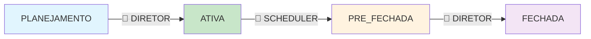

## 📚 **DOCUMENTAÇÃO COMPLETA - SISTEMA DE GERENCIAMENTO DE VIGÊNCIAS (v2.0 - RBAC)**

### **🎯 VISÃO GERAL**

O Sistema de Gerenciamento de Vigências é um módulo avançado que automatiza e governa o ciclo de vida dos períodos de premiação, garantindo transparência, auditoria completa e controle executivo sobre os resultados oficiais. **Totalmente protegido por sistema RBAC com três níveis de acesso.**

---

## **📋 ÍNDICE**

1. [Conceitos Fundamentais](#conceitos-fundamentais)
2. [Sistema de Permissões RBAC](#sistema-de-permissões-rbac)
3. [Fluxo de Estados](#fluxo-de-estados)
4. [APIs Protegidas](#apis-protegidas)
5. [Scheduler Automático](#scheduler-automático)
6. [Sistema de Empates](#sistema-de-empates)
7. [Logs de Auditoria](#logs-de-auditoria)
8. [Casos de Uso por Perfil](#casos-de-uso-por-perfil)
9. [Configuração e Deploy](#configuração-e-deploy)
10. [Troubleshooting](#troubleshooting)

---

## **🔑 CONCEITOS FUNDAMENTAIS**

### **Vigência (CompetitionPeriod)**

Uma vigência representa um período oficial de competição entre setores, com início e fim bem definidos.

**Propriedades principais:**

- `mesAno`: Período no formato YYYY-MM (ex: 2025-06)
- `dataInicio/dataFim`: Datas exatas do período
- `status`: Estado atual da vigência
- `setorVencedorId`: Setor vencedor oficial (após oficialização)
- `oficializadaPorUserId`: Diretor que oficializou os resultados

### **Estados de Vigência**

- **`PLANEJAMENTO`**: Período criado, metas sendo definidas
- **`ATIVA`**: Período em execução, dados sendo processados
- **`PRE_FECHADA`**: Período finalizado, aguardando oficialização
- **`FECHADA`**: Período oficialmente encerrado com vencedor definido

---

## **🛡️ SISTEMA DE PERMISSÕES RBAC**

### **Perfis de Usuário**

#### **🔴 DIRETOR (Controle Total)**

**Permissões:**

- `MANAGE_USERS`, `MANAGE_ROLES`, `MANAGE_PARAMETERS`
- `CLOSE_PERIODS`, `START_PERIODS`, `RESOLVE_TIES`
- `APPROVE_EXPURGOS`, `REJECT_EXPURGOS`, `DELETE_EXPURGOS`
- `VIEW_ALL_AUDIT_LOGS`, `MANAGE_SYSTEM_SETTINGS`

**Acesso às APIs de Vigência:**

- ✅ **TODAS** as APIs de consulta
- ✅ **TODAS** as APIs de ação (oficialização, início, fechamento)
- ✅ **Resolução de empates**
- ✅ **Execução manual do scheduler**

#### **🟡 GERENTE (Operacional)**

**Permissões:**

- `REQUEST_EXPURGOS`, `EDIT_OWN_EXPURGOS`
- `VIEW_REPORTS`, `VIEW_DETAILED_PERFORMANCE`
- `VIEW_SECTOR_LOGS`, `VIEW_PARAMETERS`

**Acesso às APIs de Vigência:**

- ✅ **Consultas:** períodos pendentes, análise de ranking
- ✅ **Validação:** elegibilidade de setores para empate
- ❌ **Ações:** não pode oficializar ou iniciar períodos

#### **🟢 VISUALIZADOR (Somente Leitura)**

**Permissões:**

- `VIEW_RANKINGS`, `VIEW_PUBLIC_REPORTS`
- `VIEW_OWN_PROFILE`

**Acesso às APIs de Vigência:**

- ✅ **Rankings públicos**
- ✅ **Relatórios públicos**
- ❌ **Todas as APIs de oficialização**

### **Middleware de Proteção**

```typescript
// Exemplos de proteção implementada
requirePermissions(Permission.RESOLVE_TIES, Permission.CLOSE_PERIODS); // Oficialização
adminOnly; // Apenas diretores
viewReports; // Diretores + Gerentes
```

---

## **🔄 FLUXO DE ESTADOS PROTEGIDO**



### **Transições com Controle de Acesso:**

#### **1. PLANEJAMENTO → ATIVA**

- **Gatilho:** Manual
- **Permissão:** `START_PERIODS` (APENAS DIRETOR)
- **API:** `POST /api/periods/:id/start`
- **Validações:** Todas as metas definidas + autenticação

#### **2. ATIVA → PRE_FECHADA**

- **Gatilho:** Automático (Scheduler)
- **Permissão:** Sistema (sem autenticação)
- **Horário:** Diariamente às 01:00

#### **3. PRE_FECHADA → FECHADA**

- **Gatilho:** Manual
- **Permissão:** `RESOLVE_TIES` + `CLOSE_PERIODS` (APENAS DIRETOR)
- **API:** `POST /api/periods/:id/officialize`
- **Validações:** Empates resolvidos + justificativa obrigatória

---

## **🌐 APIS PROTEGIDAS**

### **🔐 Autenticação Obrigatória**

Todas as APIs requerem token JWT válido:

```http
Authorization: Bearer <token>
```

### **📊 APIs de Consulta (Diretores + Gerentes)**

#### `GET /api/periods/pending-officialization`

**Permissão:** `VIEW_REPORTS`

```json
{
  "success": true,
  "data": {
    "periods": [
      {
        "id": 1,
        "mesAno": "2025-06",
        "status": "PRE_FECHADA",
        "dataInicio": "2025-06-01",
        "dataFim": "2025-06-30"
      }
    ],
    "count": 1
  }
}
```

#### `GET /api/periods/:id/ranking-analysis`

**Permissão:** `VIEW_REPORTS`

```json
{
  "success": true,
  "data": {
    "period": {...},
    "ranking": [...],
    "tieAnalysis": {
      "hasGlobalTies": true,
      "winnerTieGroup": {
        "pontuacao": 5.5,
        "sectors": [
          {"rank": 1, "nome": "GAMA", "pontuacao": 5.5},
          {"rank": 1, "nome": "BRASILIA", "pontuacao": 5.5}
        ]
      }
    },
    "metadata": {
      "requiresDirectorDecision": true
    }
  }
}
```

#### `GET /api/periods/:id/tie-validation/:sectorName`

**Permissão:** `VIEW_REPORTS`

```json
{
  "success": true,
  "data": {
    "sectorName": "GAMA",
    "validation": {
      "isEligible": true,
      "reason": "Setor elegível para resolução de empate na primeira posição"
    }
  }
}
```

### **⚔️ APIs de Ação Crítica (APENAS DIRETOR)**

#### `POST /api/periods/:id/officialize`

**Permissão:** `RESOLVE_TIES` + `CLOSE_PERIODS` + `adminOnly`

```json
// Request (justificativa obrigatória)
{
  "winnerSectorId": 1,
  "tieResolvedBy": 1,
  "justification": "Empate resolvido por critério de menor número de ocorrências graves"
}

// Response
{
  "success": true,
  "message": "Período 2025-06 oficializado com sucesso",
  "data": {
    "period": {
      "id": 1,
      "status": "FECHADA",
      "setorVencedorId": 1,
      "oficializadaEm": "2025-07-01T10:30:00Z",
      "oficializadaPorUserId": 5
    }
  }
}
```

### **🚫 Respostas de Erro RBAC**

#### **401 - Não Autenticado**

```json
{
  "error": "Acesso negado - usuário não autenticado",
  "code": "NOT_AUTHENTICATED"
}
```

#### **403 - Sem Permissão**

```json
{
  "error": "Acesso negado - permissões insuficientes",
  "code": "INSUFFICIENT_PERMISSIONS",
  "required": ["RESOLVE_TIES", "CLOSE_PERIODS"],
  "userPermissions": ["VIEW_REPORTS", "VIEW_RANKINGS"]
}
```

---

## **⏰ SCHEDULER AUTOMÁTICO**

### **Proteção do Scheduler**

- **Execução automática:** Sem autenticação (processo interno)
- **Execução manual:** Protegida (provavelmente `MANAGE_SYSTEM_SETTINGS`)

### **APIs do Scheduler**

```http
GET /api/system/scheduler/status          # Status atual
POST /api/system/scheduler/execute        # 🔒 Execução manual protegida
```

---

## **⚖️ SISTEMA DE EMPATES COM RBAC**

### **Fluxo Protegido de Resolução**

1. **Sistema detecta empate** (automático)
2. **Período fica PRE_FECHADA** (automático)
3. **🟡 Gerente/🔴 Diretor analisa** (`VIEW_REPORTS`)
4. **🔴 Apenas Diretor resolve** (`RESOLVE_TIES`)
5. **Sistema registra decisão** (auditoria)

### **Validações de Segurança**

- ✅ Token JWT válido
- ✅ Role DIRETOR obrigatório
- ✅ Permissões específicas
- ✅ Justificativa obrigatória (min 10 chars)
- ✅ Registro completo em auditoria

---

## **📝 LOGS DE AUDITORIA PROTEGIDOS**

### **Eventos com Contexto de Usuário**

```json
{
  "id": 123,
  "userId": 5,
  "userName": "João Diretor",
  "actionType": "PERIODO_OFICIALIZADO",
  "entityType": "CompetitionPeriodEntity",
  "entityId": "5",
  "details": {
    "mesAno": "2025-06",
    "vencedorSetor": "GAMA",
    "empateResolvido": true,
    "userRole": "DIRETOR",
    "userPermissions": ["RESOLVE_TIES", "CLOSE_PERIODS"],
    "ipAddress": "192.168.1.100"
  },
  "justification": "Período oficializado - empate resolvido por critério de menor impacto operacional",
  "timestamp": "2025-07-01T10:30:15Z",
  "competitionPeriodId": 5
}
```

### **Acesso aos Logs**

- **🔴 DIRETOR:** `VIEW_ALL_AUDIT_LOGS` (todos os logs)
- **🟡 GERENTE:** `VIEW_SECTOR_LOGS` (apenas do próprio setor)
- **🟢 VISUALIZADOR:** Sem acesso a logs

---

## **🎮 CASOS DE USO POR PERFIL**

### **👨‍💼 Diretor - Ciclo Completo**

```
30/06 23:59 → Junho ativo
01/07 01:00 → Scheduler: Junho → PRE_FECHADA (automático)
01/07 09:00 → Diretor: Login + Analisa empate (VIEW_REPORTS)
01/07 09:30 → Diretor: Valida setores (VIEW_REPORTS)
01/07 09:45 → Diretor: Oficializa GAMA como vencedor (RESOLVE_TIES)
05/07 14:00 → Diretor: Ativa próximo período (START_PERIODS)
```

### **👨‍💻 Gerente - Consulta e Análise**

```
01/07 09:00 → Gerente: Login + Vê períodos pendentes ✅
01/07 09:15 → Gerente: Analisa ranking e empates ✅
01/07 09:30 → Gerente: Valida setores elegíveis ✅
01/07 09:45 → Gerente: Tenta oficializar → 403 Forbidden ❌
```

### **👀 Visualizador - Apenas Leitura**

```
02/07 10:00 → Visualizador: Login + Vê rankings públicos ✅
02/07 10:05 → Visualizador: Tenta ver pendentes → 403 Forbidden ❌
02/07 10:10 → Visualizador: Acessa relatórios públicos ✅
```

---

## **⚙️ CONFIGURAÇÃO E DEPLOY RBAC**

### **Variáveis de Ambiente**

```bash
# JWT Configuration
JWT_SECRET=sua_chave_secreta_super_forte
JWT_EXPIRATION=24h

# RBAC Settings
RBAC_ENABLED=true
DEFAULT_ROLE=VISUALIZADOR
ADMIN_EMAIL=diretor@empresa.com

# Scheduler
TZ=America/Sao_Paulo
SCHEDULER_ENABLED=true
```

### **Setup de Usuários Inicial**

```sql
-- Criar usuário diretor
INSERT INTO users (email, name, password_hash) VALUES
('diretor@empresa.com', 'Diretor Sistema', '$hashed_password');

-- Associar role
INSERT INTO user_roles (user_id, role_id) VALUES
(1, (SELECT id FROM roles WHERE name = 'DIRETOR'));
```

### **Proteção no Nginx (Produção)**

```nginx
# Rate limiting para APIs críticas
location /api/periods/*/officialize {
    limit_req zone=critical burst=3 nodelay;
    proxy_pass http://backend;
}

# Headers de segurança
add_header X-Frame-Options DENY;
add_header X-Content-Type-Options nosniff;
```

---

## **🔧 TROUBLESHOOTING RBAC**

### **Problemas de Autenticação**

#### **Token Expirado**

```bash
# Sintoma: 401 em todas as requests
# Solução: Re-login
curl -X POST /api/auth/login -d '{"email":"user@email.com","password":"123456"}'
```

#### **Permissão Insuficiente**

```bash
# Sintoma: 403 com detalhes das permissões
# Verificar permissões do usuário:
curl -H "Authorization: Bearer $TOKEN" /api/test/permissions
```

### **Debug de Permissões**

```bash
# Logs do servidor mostram:
[RBAC] Acesso negado para usuário gerente@empresa.com (ID: 2)
[RBAC] Rota: POST /api/periods/1/officialize
[RBAC] Permissões necessárias: RESOLVE_TIES, CLOSE_PERIODS
[RBAC] Permissões do usuário: VIEW_REPORTS, REQUEST_EXPURGOS
```

### **APIs de Teste**

```bash
# Verificar autenticação
curl -H "Authorization: Bearer $TOKEN" /api/test/permissions

# Teste específico para diretores
curl -H "Authorization: Bearer $TOKEN" /api/test/admin-only

# Teste para gerentes e diretores
curl -H "Authorization: Bearer $TOKEN" /api/test/manager-or-admin
```

---

## **✅ CHECKLIST DE SEGURANÇA**

### **Autenticação**

- [x] JWT com expiração configurável
- [x] Senha hasheada com salt
- [x] Rate limiting em login
- [x] Logout invalidando token

### **Autorização**

- [x] RBAC com 3 níveis (Diretor/Gerente/Visualizador)
- [x] Permissões granulares por funcionalidade
- [x] Middleware de proteção em todas as rotas críticas
- [x] Validação de permissões em tempo real

### **Auditoria**

- [x] Log de todas as ações críticas
- [x] IP e User-Agent capturados
- [x] Justificativas obrigatórias
- [x] Trilha imutável de decisões

### **APIs Críticas Protegidas**

- [x] Oficialização de períodos
- [x] Resolução de empates
- [x] Início/fechamento de períodos
- [x] Execução manual do scheduler

**🎯 O Sistema de Gerenciamento de Vigências está completamente protegido e pronto para produção!**
