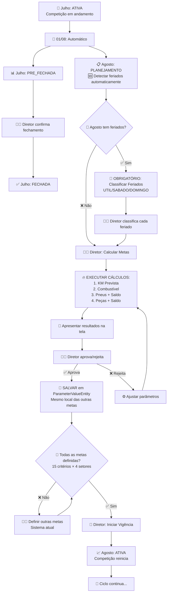
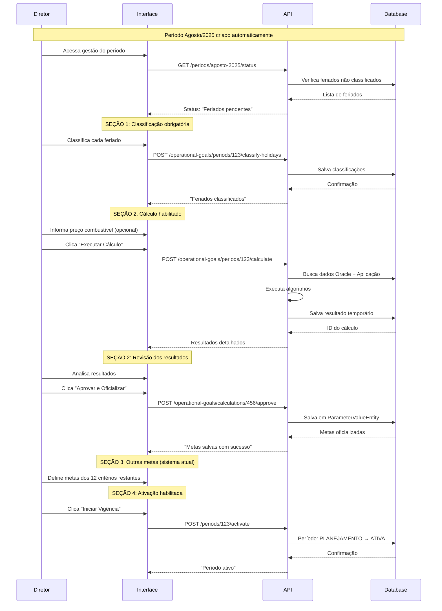

# 📋 **DOCUMENTAÇÃO TÉCNICA COMPLETA**

## **Sistema de Cálculo Automático de Metas Operacionais**

**Versão:** 1.0  
**Data:** 17 de julho de 2025  
**Objetivo:** Automatizar o cálculo de metas para COMBUSTÍVEL, PNEUS e PEÇAS integrando com o sistema de vigências existente

---

## 📑 **ÍNDICE**

1. [Visão Geral do Sistema](#1-visão-geral-do-sistema)
2. [Ciclo de Vigências e Integração](#2-ciclo-de-vigências-e-integração)
3. [Mapeamento de Fontes de Dados](#3-mapeamento-de-fontes-de-dados)
4. [Algoritmos de Cálculo](#4-algoritmos-de-cálculo)
5. [Arquitetura e Implementação](#5-arquitetura-e-implementação)
6. [APIs e Endpoints](#6-apis-e-endpoints)
7. [Interface Gerencial](#7-interface-gerencial)
8. [Integração com Sistema Atual](#8-integração-com-sistema-atual)
9. [Cronograma de Implementação](#9-cronograma-de-implementação)

---

## 1. **VISÃO GERAL DO SISTEMA**

### **1.1 Escopo da Funcionalidade**

- **Critérios Afetados:** COMBUSTÍVEL, PNEUS e PEÇAS (3 de 15 critérios totais)
- **Outros Critérios:** Mantêm o sistema de pré-cálculo atual (12 critérios restantes)
- **Fonte Principal:** Será a **única fonte oficial** para definir metas destes 3 critérios
- **Aprovação:** Metas são apresentadas para aprovação gerencial antes da oficialização

### **1.2 Diferencial vs Sistema Atual**

- **Sistema Atual:** Pré-cálculo como **sugestão** (pode ser aceito ou rejeitado)
- **Nova Implementação:** Cálculo como **fonte oficial** (deve ser aprovado para oficializar)
- **Integração:** Resultados salvos no mesmo `ParameterValueEntity` para manter compatibilidade

---

## 2. **CICLO DE VIGÊNCIAS E INTEGRAÇÃO**

### **2.1 Status das Vigências**

```
PLANEJAMENTO → ATIVA → PRE_FECHADA → FECHADA
```

### **2.2 Fluxo Completo do Sistema**

#### **📅 Exemplo: Julho/2025 → Agosto/2025**



### **2.3 Pontos de Integração Críticos**

#### **🔄 Trigger Automático (01 do mês)**

```typescript
// Evento existente que será estendido
async function onNewPeriodCreated(newPeriod: CompetitionPeriodEntity) {
  if (newPeriod.status === 'PLANEJAMENTO') {
    // 🆕 ADICIONAR: Detectar feriados automaticamente
    await this.operationalGoalsService.detectHolidaysForPeriod(newPeriod.id);
  }
}
```

#### **🎯 Verificação de Completude**

```typescript
// Antes de permitir PLANEJAMENTO → ATIVA
async function canActivatePeriod(
  competitionPeriodId: number
): Promise<boolean> {
  // Verificar se TODOS os 15 critérios × 4 setores têm metas definidas
  // Incluindo os 3 critérios calculados automaticamente
}
```

---

## 3. **MAPEAMENTO DE FONTES DE DADOS**

### **3.1 Resumo Consolidado**

| Dado Necessário               | Fonte       | Localização                | Status           |
| ----------------------------- | ----------- | -------------------------- | ---------------- |
| **KM diário por garagem**     | Oracle ERP  | Query específica           | ✅ Definida      |
| **Combustível diário**        | Oracle ERP  | Mesma query KM             | ✅ Definida      |
| **Custos Pneus (histórico)**  | Aplicação   | `PerformanceDataEntity`    | ✅ Disponível    |
| **Custos Peças (histórico)**  | Aplicação   | `PerformanceDataEntity`    | ✅ Disponível    |
| **Gasto Real (mês anterior)** | Aplicação   | `PerformanceDataEntity`    | ✅ Disponível    |
| **Metas anteriores**          | Aplicação   | `ParameterValueEntity`     | ✅ Disponível    |
| **Mapeamento Garagens**       | Aplicação   | `SectorEntity.erp_id`      | ✅ Disponível    |
| **Feriados**                  | API Externa | Brasil API + classificação | 🆕 A implementar |
| **Parâmetros configuráveis**  | Aplicação   | Sistema atual              | ✅ Disponível    |

### **3.2 Query Oracle - KM e Combustível**

```sql
-- Query fornecida para dados diários
SELECT
  A.NOMEGA,                    -- Nome da garagem
  ROUND(A.QNTCOMB, 2) AS QNTCOMB,  -- Litros consumidos
  A.KM,                        -- KM percorrido
  ROUND((A.KM / A.QNTCOMB), 2) AS KMLITRO, -- Eficiência
  A.DATAABASTCARRO             -- Data da operação
FROM (
  SELECT
    B.NOMEGA,
    B.DATAABASTCARRO,
    SUM(B.QNTCOMB) AS QNTCOMB,
    SUM(B.KM) AS KM
  FROM (
    SELECT
      G.NOMEGA,
      T.CODIGOTPFROTA,
      T.DESCRICAOTPFROTA,
      C.DATAABASTCARRO,
      C.QTDECOMB AS QNTCOMB,
      K.KMPERCORRIDOVELOC AS KM
    FROM VWABA_CONFKMCARRO K,
         FRT_CADVEICULOS V,
         VWABA_CONSCOMBREPVEIC C,
         FRT_TIPODEFROTA T,
         CTR_GARAGEM G
    WHERE V.CODIGOVEIC = K.CODIGOVEIC
      AND V.CODIGOGA = G.CODIGOGA
      AND V.CODIGOTPFROTA = T.CODIGOTPFROTA
      AND C.CODIGOVEIC = K.CODIGOVEIC
      AND K.DATAVELOC = C.DATAABASTCARRO
      AND C.SEQUENCIAABASTCARRO = K.SEQUENCIAVELOC
      AND C.DATAABASTCARRO BETWEEN ? AND ?  -- Parâmetros de data
      AND V.CODIGOEMPRESA = 4
      AND V.CODIGOGA BETWEEN 1 AND 9999
      AND V.PREFIXOVEIC BETWEEN '0226416' AND '9999999'
  ) B
  GROUP BY B.NOMEGA, B.DATAABASTCARRO
) A
ORDER BY A.NOMEGA, A.DATAABASTCARRO ASC
```

### **3.3 Mapeamento Oracle ↔ Aplicação**

```typescript
// Tabela SectorEntity
const sectorMapping = {
  1: { nome: 'GAMA', erp_id: 240, oracleNome: 'GARAGEM GAMA' },
  2: { nome: 'PARANOÁ', erp_id: 31, oracleNome: 'GARAGEM PARANOA' },
  3: { nome: 'SANTA MARIA', erp_id: 124, oracleNome: 'GARAGEM SANTA MARIA' },
  4: {
    nome: 'SÃO SEBASTIÃO',
    erp_id: 239,
    oracleNome: 'GARAGEM SAO SEBASTIAO',
  },
};

// Função de mapeamento
async function mapOracleToSector(
  oracleGarageName: string
): Promise<SectorEntity | null> {
  const mapping = {
    'GARAGEM GAMA': 240,
    'GARAGEM PARANOA': 31,
    'GARAGEM SANTA MARIA': 124,
    'GARAGEM SAO SEBASTIAO': 239,
  };

  const erpId = mapping[oracleGarageName];
  return await sectorRepo.findOne({ where: { erp_id: erpId } });
}
```

### **3.4 Estruturas de Dados Detalhadas**

#### **KM Prevista**

```typescript
interface OracleKmFuelData {
  NOMEGA: string; // "GARAGEM GAMA"
  QNTCOMB: number; // Litros consumidos no dia
  KM: number; // KM percorrido no dia
  KMLITRO: number; // Eficiência KM/L
  DATAABASTCARRO: Date; // Data da operação
}

interface KmPrevistaCalculation {
  sectorId: number;
  monthlyData: {
    totalKm: number;
    averages: {
      diasUteis: number; // Média KM em dias úteis
      sabados: number; // Média KM em sábados
      domingosFeriados: number; // Média KM em domingos/feriados
    };
  };
  projectedKm: number; // KM total prevista para próximo mês
  calendarProjection: {
    qtdDiasUteis: number;
    qtdSabados: number;
    qtdDomingosFeriados: number;
  };
}
```

#### **Combustível**

```typescript
interface CombustivelCalculation {
  sectorId: number;
  kmPrevista: number; // Do cálculo anterior
  historical3Months: {
    totalKm: number; // Soma 3 meses
    totalLiters: number; // Soma 3 meses
    avgKmPerLiter: number; // Eficiência média
  };
  fatorReducao: number; // Ex: 0.015 (1.5%)
  metaLitros: number; // Meta operacional
  metaReais: number; // Valor informativo
  precoPorLitro: number; // Input manual
}
```

#### **Pneus e Peças**

```typescript
interface PneusPecasCalculation {
  sectorId: number;
  criterionType: 'PNEUS' | 'PEÇAS';
  kmPrevista: number; // Do cálculo anterior

  // Custo médio anual (últimos 12 meses)
  annualCostData: {
    totalKm12Months: number; // Soma 12 meses
    totalCost12Months: number; // Custo total 12 meses
    avgCostPerKm: number; // R$ por KM
  };

  // Cálculo da meta base
  custoPrevistoKm: number; // kmPrevista × avgCostPerKm
  percentualPremiacao: number; // Ex: 0.03 (3%)
  metaBase: number; // custoPrevistoKm × (1 - premiacao)

  // Sistema de Saldo
  previousMonth: {
    metaAprovada: number; // ParameterValueEntity
    gastoReal: number; // PerformanceDataEntity
    percentualTolerancia: number; // Ex: 0.08 (8%)
    saldoDevedor: number; // Calculado se gasto > (meta + tolerância)
  };

  metaFinal: number; // metaBase - saldoDevedor
}
```

---

## 4. **ALGORITMOS DE CÁLCULO**

### **4.1 Sequência de Execução**

```
1. KM PREVISTA (base para todos) →
2. COMBUSTÍVEL (usa KM + histórico) →
3. PNEUS (usa KM + saldo) →
4. PEÇAS (usa KM + saldo)
```

### **4.2 KM Prevista - Algoritmo Detalhado**

#### **Pré-requisito: Classificação de Feriados**

```typescript
// OBRIGATÓRIO: Todos os feriados devem estar classificados
async function validateHolidayClassification(
  competitionPeriodId: number
): Promise<void> {
  const unclassified = await holidayRepo.find({
    where: {
      competitionPeriodId,
      classification: IsNull(),
    },
  });

  if (unclassified.length > 0) {
    throw new Error('HOLIDAYS_NOT_CLASSIFIED');
  }
}
```

#### **Etapa A: Análise do Mês de Referência (M)**

```typescript
async function analyzeReferenceMonth(sectorId: number, referenceMonth: string) {
  // 1. Buscar dados diários do Oracle
  const dailyData = await oracleService.fetchDailyKmAndFuel(
    `${referenceMonth}-01`,
    `${referenceMonth}-31`
  );

  // 2. Segmentar por tipo de dia
  const segmentedData = {
    diasUteis: [],
    sabados: [],
    domingosFeriados: [],
  };

  for (const day of dailyData) {
    const dayType = getDayType(day.DATAABASTCARRO); // Considera feriados históricos
    segmentedData[dayType].push(day.KM);
  }

  // 3. Calcular médias
  return {
    mediaKmUtil: average(segmentedData.diasUteis),
    mediaKmSabado: average(segmentedData.sabados),
    mediaKmDomFer: average(segmentedData.domingosFeriados),
  };
}
```

#### **Etapa B: Projeção para Mês Futuro (M+1)**

```typescript
async function projectFutureMonth(
  averages: DailyAverages,
  futureMonth: string
) {
  // 1. Contar dias por categoria (considerando classificações manuais)
  const calendar = await calculateMonthCalendar(futureMonth);

  // 2. Projetar KM por categoria
  const projection = {
    kmUteis: averages.mediaKmUtil * calendar.qtdDiasUteis,
    kmSabados: averages.mediaKmSabado * calendar.qtdSabados,
    kmDomingosFeriados: averages.mediaKmDomFer * calendar.qtdDomingosFeriados,
  };

  // 3. Total
  return (
    projection.kmUteis + projection.kmSabados + projection.kmDomingosFeriados
  );
}
```

### **4.3 Combustível - Algoritmo**

```typescript
async function calculateCombustivel(kmPrevista: number, sectorId: number) {
  // 1. Buscar histórico 3 meses
  const historical = await oracleService.fetchHistorical3Months(sectorId);

  // 2. Calcular média KM/L
  const totalKm = historical.reduce((sum, month) => sum + month.KM, 0);
  const totalLiters = historical.reduce((sum, month) => sum + month.QNTCOMB, 0);
  const avgKmPerLiter = totalKm / totalLiters;

  // 3. Calcular previsão bruta
  const litrosPrevistoBruto = kmPrevista / avgKmPerLiter;

  // 4. Aplicar fator de redução (parâmetro configurável)
  const fatorReducao = await getParameter('FATOR_REDUCAO_COMBUSTIVEL'); // Ex: 0.015
  const metaLitros = litrosPrevistoBruto * (1 - fatorReducao);

  // 5. Projeção financeira (informativo)
  const precoPorLitro = await getManualInput('PRECO_COMBUSTIVEL'); // Input da tela
  const metaReais = litrosPrevistoBruto * precoPorLitro;

  return {
    metaLitros, // META OFICIAL
    metaReais, // INFORMATIVO
  };
}
```

### **4.4 Pneus e Peças - Algoritmo com Saldo**

```typescript
async function calculatePneusPecas(
  kmPrevista: number,
  sectorId: number,
  criterionType: 'PNEUS' | 'PEÇAS'
) {
  // 1. Calcular custo médio anual (últimos 12 meses)
  const annualData = await appDataService.getHistoricalCosts(criterionType, 12);
  const totalKm12M = annualData.reduce((sum, month) => sum + month.totalKm, 0);
  const totalCost12M = annualData.reduce(
    (sum, month) => sum + month.totalCost,
    0
  );
  const avgCostPerKm = totalCost12M / totalKm12M;

  // 2. Calcular meta base
  const custoPrevistoKm = kmPrevista * avgCostPerKm;
  const percentualPremiacao = await getParameter(
    `PERCENTUAL_PREMIACAO_${criterionType}`
  ); // Ex: 0.03
  const metaBase = custoPrevistoKm * (1 - percentualPremiacao);

  // 3. Calcular saldo devedor do mês anterior
  const previousMonthData = await getPreviousMonthData(sectorId, criterionType);
  const saldoDevedor = calculateSaldoDevedor(previousMonthData);

  // 4. Meta final
  const metaFinal = metaBase - saldoDevedor;

  return {
    metaFinal, // META OFICIAL
    metaBase, // Para transparência
    saldoDevedor, // Para auditoria
  };
}

function calculateSaldoDevedor(previousData: PreviousMonthData): number {
  const { metaAprovada, gastoReal, percentualTolerancia } = previousData;
  const tetoGasto = metaAprovada * (1 + percentualTolerancia);

  return gastoReal > tetoGasto ? gastoReal - tetoGasto : 0;
}
```

---

## 5. **ARQUITETURA E IMPLEMENTAÇÃO**

### **5.1 Novas Entidades (TypeORM)**

```typescript
@Entity('operational_goals_calculations')
export class OperationalGoalsCalculationEntity {
  @PrimaryGeneratedColumn()
  id!: number;

  @Column()
  competitionPeriodId!: number;

  @ManyToOne(() => CompetitionPeriodEntity, { onDelete: 'CASCADE' })
  @JoinColumn({ name: 'competitionPeriodId' })
  competitionPeriod!: CompetitionPeriodEntity;

  @Column('jsonb')
  calculationData!: {
    kmPrevista: Record<string, KmPrevistaCalculation>;
    combustivel: Record<string, CombustivelCalculation>;
    pneus: Record<string, PneusPecasCalculation>;
    pecas: Record<string, PneusPecasCalculation>;
  };

  @Column({
    type: 'varchar',
    enum: ['PENDING', 'COMPLETED', 'APPROVED', 'REJECTED'],
    default: 'PENDING',
  })
  status!: 'PENDING' | 'COMPLETED' | 'APPROVED' | 'REJECTED';

  @Column()
  calculatedBy!: number;

  @ManyToOne(() => UserEntity, { onDelete: 'SET NULL' })
  @JoinColumn({ name: 'calculatedBy' })
  calculatedByUser!: UserEntity;

  @Column({ nullable: true })
  approvedBy?: number;

  @Column({ type: 'timestamp with time zone', nullable: true })
  approvedAt?: Date;

  @CreateDateColumn()
  calculatedAt!: Date;

  @Column('text', { nullable: true })
  observations?: string;
}

@Entity('holiday_classifications')
export class HolidayClassificationEntity {
  @PrimaryGeneratedColumn()
  id!: number;

  @Column('date')
  holidayDate!: string;

  @Column('varchar', { length: 100 })
  holidayName!: string;

  @Column({
    type: 'varchar',
    enum: ['UTIL', 'SABADO', 'DOMINGO_FERIADO'],
  })
  classification!: 'UTIL' | 'SABADO' | 'DOMINGO_FERIADO';

  @Column()
  competitionPeriodId!: number;

  @ManyToOne(() => CompetitionPeriodEntity, { onDelete: 'CASCADE' })
  @JoinColumn({ name: 'competitionPeriodId' })
  competitionPeriod!: CompetitionPeriodEntity;

  @Column()
  classifiedBy!: number;

  @ManyToOne(() => UserEntity, { onDelete: 'SET NULL' })
  @JoinColumn({ name: 'classifiedBy' })
  classifiedByUser!: UserEntity;

  @CreateDateColumn()
  classifiedAt!: Date;
}

@Entity('calculation_parameters')
export class CalculationParametersEntity {
  @PrimaryGeneratedColumn()
  id!: number;

  @Column('varchar', { length: 100, unique: true })
  parameterName!: string;

  @Column('decimal', { precision: 10, scale: 6 })
  value!: number;

  @Column('text')
  description!: string;

  @Column('varchar', { length: 50 })
  category!: string; // 'COMBUSTIVEL', 'PNEUS', 'PECAS', 'GERAL'

  // 🆕 ADICIONAR CAMPOS DE AUDITORIA:
  @Column('decimal', { precision: 10, scale: 6, nullable: true })
  previousValue?: number;

  @Column('text', { nullable: true })
  changeJustification?: string;

  @UpdateDateColumn()
  updatedAt!: Date;

  @Column()
  updatedBy!: number;

  @ManyToOne(() => UserEntity, { onDelete: 'SET NULL' })
  @JoinColumn({ name: 'updatedBy' })
  updatedByUser!: UserEntity;
}
```

### **5.2 Novos Serviços**

#### **HolidayManagementService**

```typescript
export class HolidayManagementService {
  constructor(
    private holidayRepo: Repository<HolidayClassificationEntity>,
    private periodRepo: Repository<CompetitionPeriodEntity>
  ) {}

  async detectHolidaysForPeriod(
    competitionPeriodId: number
  ): Promise<Holiday[]> {
    const period = await this.periodRepo.findOneById(competitionPeriodId);
    const [year, month] = period.mesAno.split('-');

    // Buscar feriados da API Brasil
    const holidays = await this.fetchHolidaysFromBrasilAPI(year, month);

    // Salvar como não classificados
    await this.saveUnclassifiedHolidays(competitionPeriodId, holidays);

    return holidays;
  }

  async requiresClassification(competitionPeriodId: number): Promise<boolean> {
    const unclassified = await this.holidayRepo.count({
      where: {
        competitionPeriodId,
        classification: IsNull(),
      },
    });

    return unclassified > 0;
  }

  async saveClassifications(
    competitionPeriodId: number,
    classifications: HolidayClassificationDto[],
    userId: number
  ): Promise<void> {
    for (const classification of classifications) {
      await this.holidayRepo.update(
        { competitionPeriodId, holidayDate: classification.date },
        {
          classification: classification.classification,
          classifiedBy: userId,
          classifiedAt: new Date(),
        }
      );
    }
  }

  private async fetchHolidaysFromBrasilAPI(
    year: string,
    month: string
  ): Promise<Holiday[]> {
    // Implementar chamada para https://brasilapi.com.br/api/feriados/v1/{year}
    // Filtrar por mês e por Brasília-DF
  }
}
```

#### **OperationalGoalsOracleService**

```typescript
export class OperationalGoalsOracleService {
  constructor(private oracleDataSource: DataSource) {}

  async fetchDailyKmAndFuel(
    startDate: string,
    endDate: string
  ): Promise<OracleKmFuelData[]> {
    const query = `
      SELECT
        A.NOMEGA,
        ROUND(A.QNTCOMB, 2) AS QNTCOMB,        
        A.KM,
        ROUND((A.KM / A.QNTCOMB), 2) AS KMLITRO,
        A.DATAABASTCARRO
      FROM (
        SELECT
          B.NOMEGA,
          B.DATAABASTCARRO,
          SUM(B.QNTCOMB) AS QNTCOMB,        
          SUM(B.KM) AS KM
        FROM (
          SELECT
            G.NOMEGA,
            T.CODIGOTPFROTA,
            T.DESCRICAOTPFROTA,
            C.DATAABASTCARRO,
            C.QTDECOMB AS QNTCOMB,        
            K.KMPERCORRIDOVELOC AS KM
          FROM VWABA_CONFKMCARRO K,
               FRT_CADVEICULOS V,
               VWABA_CONSCOMBREPVEIC C,
               FRT_TIPODEFROTA T,
               CTR_GARAGEM G
          WHERE V.CODIGOVEIC = K.CODIGOVEIC
            AND V.CODIGOGA = G.CODIGOGA
            AND V.CODIGOTPFROTA = T.CODIGOTPFROTA
            AND C.CODIGOVEIC = K.CODIGOVEIC
            AND K.DATAVELOC = C.DATAABASTCARRO
            AND C.SEQUENCIAABASTCARRO = K.SEQUENCIAVELOC    
            AND C.DATAABASTCARRO BETWEEN ? AND ?
            AND V.CODIGOEMPRESA = 4
            AND V.CODIGOGA BETWEEN 1 AND 9999
            AND V.PREFIXOVEIC BETWEEN '0226416' AND '9999999'
        ) B
        GROUP BY B.NOMEGA, B.DATAABASTCARRO
      ) A
      ORDER BY A.NOMEGA, A.DATAABASTCARRO ASC
    `;

    return await this.oracleDataSource.query(query, [startDate, endDate]);
  }

  async fetchHistorical3Months(
    sectorErpId: number
  ): Promise<HistoricalFuelData[]> {
    // Implementar busca de dados históricos de 3 meses
    // Agrupar por mês para cálculo de média
  }
}
```

#### **OperationalGoalsAppDataService**

```typescript
export class OperationalGoalsAppDataService {
  constructor(
    private performanceRepo: Repository<PerformanceDataEntity>,
    private parameterRepo: Repository<ParameterValueEntity>,
    private criterionRepo: Repository<CriterionEntity>
  ) {}

  async getHistoricalCosts(
    criterionName: 'PNEUS' | 'PEÇAS',
    monthsBack: number = 12
  ): Promise<HistoricalCostData[]> {
    const criterion = await this.criterionRepo.findOne({
      where: { nome: criterionName },
    });

    const endDate = new Date();
    const startDate = new Date();
    startDate.setMonth(startDate.getMonth() - monthsBack);

    return await this.performanceRepo.find({
      where: {
        criterionId: criterion.id,
        metricDate: Between(
          startDate.toISOString().split('T')[0],
          endDate.toISOString().split('T')[0]
        ),
      },
      relations: ['setor'],
      order: { metricDate: 'ASC' },
    });
  }

  async getPreviousMonthData(
    sectorId: number,
    criterionName: 'PNEUS' | 'PEÇAS',
    currentPeriodId: number
  ): Promise<SaldoCalculationData> {
    // Buscar período anterior
    const currentPeriod = await this.periodRepo.findOne({
      where: { id: currentPeriodId },
    });
    const previousPeriodDate = this.getPreviousMonth(currentPeriod.mesAno);
    const previousPeriod = await this.periodRepo.findOne({
      where: { mesAno: previousPeriodDate },
    });

    if (!previousPeriod) {
      return { metaAprovada: 0, gastoReal: 0, percentualTolerancia: 0.08 };
    }

    // Buscar meta aprovada (ParameterValueEntity)
    const criterion = await this.criterionRepo.findOne({
      where: { nome: criterionName },
    });

    const metaAprovada = await this.parameterRepo.findOne({
      where: {
        competitionPeriodId: previousPeriod.id,
        sectorId,
        criterionId: criterion.id,
        dataFimEfetivo: IsNull(),
      },
    });

    // Buscar gasto real (PerformanceDataEntity)
    const gastoReal = await this.performanceRepo.findOne({
      where: {
        competitionPeriodId: previousPeriod.id,
        sectorId,
        criterionId: criterion.id,
      },
    });

    // Buscar parâmetro de tolerância
    const tolerancia = await this.getParameter('PERCENTUAL_TOLERANCIA_SALDO');

    return {
      metaAprovada: metaAprovada ? parseFloat(metaAprovada.valor) : 0,
      gastoReal: gastoReal?.valor || 0,
      percentualTolerancia: tolerancia,
    };
  }

  private async getParameter(parameterName: string): Promise<number> {
    const param = await this.calculationParametersRepo.findOne({
      where: { parameterName },
    });
    return param?.value || 0;
  }
}
```

#### **OperationalGoalsCalculationService**

```typescript
export class OperationalGoalsCalculationService {
  constructor(
    private oracleService: OperationalGoalsOracleService,
    private appDataService: OperationalGoalsAppDataService,
    private holidayService: HolidayManagementService,
    private sectorRepo: Repository<SectorEntity>,
    private calculationRepo: Repository<OperationalGoalsCalculationEntity>
  ) {}

  async executeFullCalculation(
    competitionPeriodId: number,
    userId: number
  ): Promise<OperationalGoalsCalculationEntity> {
    // 1. Validar pré-requisitos
    await this.validatePrerequisites(competitionPeriodId);

    // 2. Buscar setores ativos
    const activeSectors = await this.sectorRepo.find({
      where: { ativo: true },
    });

    // 3. Executar cálculos para cada setor
    const results = {
      kmPrevista: {},
      combustivel: {},
      pneus: {},
      pecas: {},
    };

    for (const sector of activeSectors) {
      // KM Prevista
      const kmResult = await this.calculateKmPrevista(
        competitionPeriodId,
        sector.id
      );
      results.kmPrevista[sector.id] = kmResult;

      // Combustível
      const combustivelResult = await this.calculateCombustivel(
        kmResult.projectedKm,
        sector.erp_id
      );
      results.combustivel[sector.id] = combustivelResult;

      // Pneus
      const pneusResult = await this.calculatePneusPecas(
        kmResult.projectedKm,
        sector.id,
        'PNEUS'
      );
      results.pneus[sector.id] = pneusResult;

      // Peças
      const pecasResult = await this.calculatePneusPecas(
        kmResult.projectedKm,
        sector.id,
        'PEÇAS'
      );
      results.pecas[sector.id] = pecasResult;
    }

    // 4. Salvar cálculo
    const calculation = this.calculationRepo.create({
      competitionPeriodId,
      calculationData: results,
      status: 'COMPLETED',
      calculatedBy: userId,
    });

    return await this.calculationRepo.save(calculation);
  }

  private async validatePrerequisites(
    competitionPeriodId: number
  ): Promise<void> {
    // Verificar se período está em PLANEJAMENTO
    const period = await this.periodRepo.findOne({
      where: { id: competitionPeriodId },
    });
    if (period?.status !== 'PLANEJAMENTO') {
      throw new Error('PERIOD_NOT_IN_PLANNING');
    }

    // Verificar se feriados estão classificados
    const requiresClassification =
      await this.holidayService.requiresClassification(competitionPeriodId);
    if (requiresClassification) {
      throw new Error('HOLIDAYS_NOT_CLASSIFIED');
    }
  }

  private async calculateKmPrevista(
    competitionPeriodId: number,
    sectorId: number
  ): Promise<KmPrevistaCalculation> {
    // Implementar algoritmo detalhado da seção 4.2
    const period = await this.periodRepo.findOne({
      where: { id: competitionPeriodId },
    });
    const sector = await this.sectorRepo.findOne({ where: { id: sectorId } });

    // Buscar dados do mês de referência (mês anterior)
    const referenceMonth = this.getPreviousMonth(period.mesAno);
    const startDate = `${referenceMonth}-01`;
    const endDate = `${referenceMonth}-31`;

    const oracleData = await this.oracleService.fetchDailyKmAndFuel(
      startDate,
      endDate
    );
    const sectorData = oracleData.filter(
      (d) => this.mapOracleToSectorId(d.NOMEGA) === sectorId
    );

    // Analisar padrão diário e projetar para próximo mês
    const averages = await this.analyzeReferenceMonth(sectorData);
    const projection = await this.projectFutureMonth(averages, period.mesAno);

    return {
      sectorId,
      monthlyData: {
        totalKm: sectorData.reduce((sum, d) => sum + d.KM, 0),
        averages,
      },
      projectedKm: projection.totalKm,
      calendarProjection: projection.calendar,
    };
  }

  private async calculateCombustivel(
    kmPrevista: number,
    sectorErpId: number
  ): Promise<CombustivelCalculation> {
    // Implementar algoritmo da seção 4.3
    const historical =
      await this.oracleService.fetchHistorical3Months(sectorErpId);

    const totalKm = historical.reduce((sum, month) => sum + month.totalKm, 0);
    const totalLiters = historical.reduce(
      (sum, month) => sum + month.totalLiters,
      0
    );
    const avgKmPerLiter = totalKm / totalLiters;

    const litrosPrevistoBruto = kmPrevista / avgKmPerLiter;
    const fatorReducao = await this.appDataService.getParameter(
      'FATOR_REDUCAO_COMBUSTIVEL'
    );
    const metaLitros = litrosPrevistoBruto * (1 - fatorReducao);

    return {
      sectorId: this.mapErpIdToSectorId(sectorErpId),
      kmPrevista,
      historical3Months: {
        totalKm,
        totalLiters,
        avgKmPerLiter,
      },
      fatorReducao,
      metaLitros,
      metaReais: 0, // Será calculado com input manual na interface
      precoPorLitro: 0,
    };
  }

  private async calculatePneusPecas(
    kmPrevista: number,
    sectorId: number,
    criterionType: 'PNEUS' | 'PEÇAS'
  ): Promise<PneusPecasCalculation> {
    // Implementar algoritmo da seção 4.4
    const annualData = await this.appDataService.getHistoricalCosts(
      criterionType,
      12
    );
    const sectorAnnualData = annualData.filter((d) => d.sectorId === sectorId);

    const totalKm12M = sectorAnnualData.reduce(
      (sum, month) => sum + month.totalKm,
      0
    );
    const totalCost12M = sectorAnnualData.reduce(
      (sum, month) => sum + month.totalCost,
      0
    );
    const avgCostPerKm = totalCost12M / totalKm12M;

    const custoPrevistoKm = kmPrevista * avgCostPerKm;
    const percentualPremiacao = await this.appDataService.getParameter(
      `PERCENTUAL_PREMIACAO_${criterionType}`
    );
    const metaBase = custoPrevistoKm * (1 - percentualPremiacao);

    const previousMonthData = await this.appDataService.getPreviousMonthData(
      sectorId,
      criterionType,
      competitionPeriodId
    );
    const saldoDevedor = this.calculateSaldoDevedor(previousMonthData);

    return {
      sectorId,
      criterionType,
      kmPrevista,
      annualCostData: {
        totalKm12Months: totalKm12M,
        totalCost12Months: totalCost12M,
        avgCostPerKm,
      },
      custoPrevistoKm,
      percentualPremiacao,
      metaBase,
      previousMonth: {
        ...previousMonthData,
        saldoDevedor,
      },
      metaFinal: metaBase - saldoDevedor,
    };
  }

  private calculateSaldoDevedor(previousData: SaldoCalculationData): number {
    const { metaAprovada, gastoReal, percentualTolerancia } = previousData;
    const tetoGasto = metaAprovada * (1 + percentualTolerancia);

    return gastoReal > tetoGasto ? gastoReal - tetoGasto : 0;
  }
}
```

### **5.3 Extensão do ParameterService Existente**

```typescript
// Adicionar ao ParameterService existente
export class ParameterService {
  // ... métodos existentes ...

  /**
   * 🆕 Método para salvar metas calculadas automaticamente
   */
  async saveOperationalGoalsMetas(
    calculationId: number,
    userId: number
  ): Promise<ParameterValueEntity[]> {
    const calculation = await this.calculationRepo.findOne({
      where: { id: calculationId },
      relations: ['competitionPeriod'],
    });

    if (!calculation) {
      throw new Error('CALCULATION_NOT_FOUND');
    }

    const savedParameters: ParameterValueEntity[] = [];
    const actingUser = await this.userRepo.findOne({ where: { id: userId } });

    // Mapear critérios
    const criterionMapping = {
      COMBUSTIVEL: await this.getCriterionId('COMBUSTÍVEL'),
      PNEUS: await this.getCriterionId('PNEUS'),
      PECAS: await this.getCriterionId('PEÇAS'),
    };

    // Salvar para cada setor
    for (const [sectorId, results] of Object.entries(
      calculation.calculationData.combustivel
    )) {
      // 🔥 COMBUSTÍVEL
      const combustivelParam = await this.createParameter(
        {
          criterionId: criterionMapping.COMBUSTIVEL,
          sectorId: parseInt(sectorId),
          competitionPeriodId: calculation.competitionPeriodId,
          valor: results.metaLitros.toString(),
          dataInicioEfetivo: calculation.competitionPeriod.dataInicio,
          justificativa: `Meta automática operacional - Cálculo ID: ${calculationId}`,
          metadata: {
            calculationId,
            isOperationalGoal: true,
            algorithm: 'operational_goals_v3.0',
            calculationType: 'COMBUSTIVEL',
          },
        },
        actingUser
      );

      savedParameters.push(combustivelParam);

      // 🔥 PNEUS
      const pneusData = calculation.calculationData.pneus[sectorId];
      const pneusParam = await this.createParameter(
        {
          criterionId: criterionMapping.PNEUS,
          sectorId: parseInt(sectorId),
          competitionPeriodId: calculation.competitionPeriodId,
          valor: pneusData.metaFinal.toString(),
          dataInicioEfetivo: calculation.competitionPeriod.dataInicio,
          justificativa: `Meta automática operacional - Cálculo ID: ${calculationId}`,
          metadata: {
            calculationId,
            isOperationalGoal: true,
            algorithm: 'operational_goals_v3.0',
            calculationType: 'PNEUS',
            metaBase: pneusData.metaBase,
            saldoDevedor: pneusData.previousMonth.saldoDevedor,
          },
        },
        actingUser
      );

      savedParameters.push(pneusParam);

      // 🔥 PEÇAS
      const pecasData = calculation.calculationData.pecas[sectorId];
      const pecasParam = await this.createParameter(
        {
          criterionId: criterionMapping.PECAS,
          sectorId: parseInt(sectorId),
          competitionPeriodId: calculation.competitionPeriodId,
          valor: pecasData.metaFinal.toString(),
          dataInicioEfetivo: calculation.competitionPeriod.dataInicio,
          justificativa: `Meta automática operacional - Cálculo ID: ${calculationId}`,
          metadata: {
            calculationId,
            isOperationalGoal: true,
            algorithm: 'operational_goals_v3.0',
            calculationType: 'PECAS',
            metaBase: pecasData.metaBase,
            saldoDevedor: pecasData.previousMonth.saldoDevedor,
          },
        },
        actingUser
      );

      savedParameters.push(pecasParam);
    }

    // Marcar cálculo como aprovado
    await this.calculationRepo.update(calculationId, {
      status: 'APPROVED',
      approvedBy: userId,
      approvedAt: new Date(),
    });

    return savedParameters;
  }

  private async getCriterionId(criterionName: string): Promise<number> {
    const criterion = await this.criterionRepo.findOne({
      where: { nome: criterionName },
    });
    if (!criterion) {
      throw new Error(`Critério ${criterionName} não encontrado`);
    }
    return criterion.id;
  }
}
```

---

## 6. **APIs E ENDPOINTS**

### **6.1 Novas Rotas Específicas**

```typescript
// apps/api/src/routes/operational-goals.routes.ts
const operationalGoalsRoutes: FastifyPluginAsync = async (fastify) => {
  /**
   * GET /api/operational-goals/periods/:periodId/holidays-status
   * Verificar status de classificação de feriados
   */
  fastify.get<{ Params: { periodId: string } }>(
    '/api/operational-goals/periods/:periodId/holidays-status',
    {
      preHandler: [fastify.authenticate, requireViewReports],
      schema: {
        description: 'Verificar status de feriados para o período',
        tags: ['Operational Goals'],
        params: {
          type: 'object',
          properties: {
            periodId: { type: 'string' },
          },
        },
        response: {
          200: {
            type: 'object',
            properties: {
              hasUnclassifiedHolidays: { type: 'boolean' },
              holidays: {
                type: 'array',
                items: {
                  type: 'object',
                  properties: {
                    date: { type: 'string' },
                    name: { type: 'string' },
                    isClassified: { type: 'boolean' },
                    classification: { type: 'string', nullable: true },
                  },
                },
              },
            },
          },
        },
      },
    },
    controller.getHolidaysStatus.bind(controller)
  );

  /**
   * POST /api/operational-goals/periods/:periodId/classify-holidays
   * Classificar feriados (DIRETOR apenas)
   */
  fastify.post<{
    Params: { periodId: string };
    Body: { classifications: HolidayClassificationDto[] };
  }>(
    '/api/operational-goals/periods/:periodId/classify-holidays',
    {
      preHandler: [fastify.authenticate, requireDirectorRole],
      schema: {
        description: 'Classificar feriados do período (somente diretores)',
        tags: ['Operational Goals'],
        params: {
          type: 'object',
          properties: {
            periodId: { type: 'string' },
          },
        },
        body: {
          type: 'object',
          properties: {
            classifications: {
              type: 'array',
              items: {
                type: 'object',
                properties: {
                  date: { type: 'string' },
                  classification: {
                    type: 'string',
                    enum: ['UTIL', 'SABADO', 'DOMINGO_FERIADO'],
                  },
                },
                required: ['date', 'classification'],
              },
            },
          },
          required: ['classifications'],
        },
      },
    },
    controller.classifyHolidays.bind(controller)
  );

  /**
   * POST /api/operational-goals/periods/:periodId/calculate
   * Executar cálculo de metas (DIRETOR apenas)
   */
  fastify.post<{
    Params: { periodId: string };
    Body: { precoCombustivel?: number };
  }>(
    '/api/operational-goals/periods/:periodId/calculate',
    {
      preHandler: [fastify.authenticate, requireDirectorRole],
      schema: {
        description: 'Executar cálculo automático de metas operacionais',
        tags: ['Operational Goals'],
        params: {
          type: 'object',
          properties: {
            periodId: { type: 'string' },
          },
        },
        body: {
          type: 'object',
          properties: {
            precoCombustivel: {
              type: 'number',
              description: 'Preço por litro para cálculo informativo',
            },
          },
        },
        response: {
          200: {
            type: 'object',
            properties: {
              calculationId: { type: 'number' },
              status: { type: 'string' },
              results: {
                type: 'object',
                description: 'Resultados dos cálculos por setor',
              },
            },
          },
        },
      },
    },
    controller.calculateGoals.bind(controller)
  );

  /**
   * POST /api/operational-goals/calculations/:calculationId/approve
   * Aprovar cálculo e salvar como metas oficiais (DIRETOR)
   */
  fastify.post<{
    Params: { calculationId: string };
    Body: { observations?: string };
  }>(
    '/api/operational-goals/calculations/:calculationId/approve',
    {
      preHandler: [fastify.authenticate, requireDirectorRole],
      schema: {
        description: 'Aprovar cálculo e oficializar metas',
        tags: ['Operational Goals'],
        params: {
          type: 'object',
          properties: {
            calculationId: { type: 'string' },
          },
        },
        body: {
          type: 'object',
          properties: {
            observations: { type: 'string' },
          },
        },
      },
    },
    controller.approveCalculation.bind(controller)
  );

  /**
   * GET /api/operational-goals/calculations/:calculationId
   * Buscar detalhes de um cálculo específico
   */
  fastify.get<{ Params: { calculationId: string } }>(
    '/api/operational-goals/calculations/:calculationId',
    {
      preHandler: [fastify.authenticate, requireViewReports],
      schema: {
        description: 'Buscar detalhes de cálculo específico',
        tags: ['Operational Goals'],
      },
    },
    controller.getCalculationDetails.bind(controller)
  );

  /**
   * GET /api/operational-goals/parameters
   * Buscar parâmetros configuráveis do sistema
   */
  fastify.get(
    '/api/operational-goals/parameters',
    {
      preHandler: [fastify.authenticate, requireViewParameters],
      schema: {
        description: 'Buscar parâmetros configuráveis',
        tags: ['Operational Goals'],
      },
    },
    controller.getCalculationParameters.bind(controller)
  );

  /**
   * PUT /api/operational-goals/parameters/:parameterId
   * Atualizar parâmetro específico (DIRETOR)
   */
  fastify.put<{
    Params: { parameterId: string };
    Body: { value: number; justification: string };
  }>(
    '/api/operational-goals/parameters/:parameterId',
    {
      preHandler: [fastify.authenticate, requireDirectorRole],
      schema: {
        description: 'Atualizar parâmetro de cálculo',
        tags: ['Operational Goals'],
      },
    },
    controller.updateCalculationParameter.bind(controller)
  );

  fastify.log.info('✅ Rotas de Metas Operacionais registradas');
};

export default fp(operationalGoalsRoutes, {
  name: 'operational-goals-routes',
});

/**
 * GET /api/operational-goals/parameters
 * Buscar parâmetros configuráveis (TODOS OS USUÁRIOS)
 */
fastify.get(
  '/api/operational-goals/parameters',
  {
    preHandler: [fastify.authenticate],
    schema: {
      description: 'Buscar parâmetros configuráveis do sistema',
      tags: ['Operational Goals - Parameters'],
    },
  },
  controller.getParameters.bind(controller)
);

/**
 * PUT /api/operational-goals/parameters/:parameterName
 * Atualizar parâmetro específico (SOMENTE DIRETORES)
 */
fastify.put<{
  Params: { parameterName: string };
  Body: { value: number; justification: string };
}>(
  '/api/operational-goals/parameters/:parameterName',
  {
    preHandler: [fastify.authenticate, requireDirectorRole],
    schema: {
      description: 'Atualizar parâmetro de cálculo (somente diretores)',
      tags: ['Operational Goals - Parameters'],
      body: {
        type: 'object',
        properties: {
          value: { type: 'number' },
          justification: { type: 'string', minLength: 10 },
        },
        required: ['value', 'justification'],
      },
    },
  },
  controller.updateParameter.bind(controller)
);
```

### **6.2 Controller Implementation**

```typescript
// apps/api/src/controllers/operational-goals.controller.ts
export class OperationalGoalsController {
  constructor(
    private holidayService: HolidayManagementService,
    private calculationService: OperationalGoalsCalculationService,
    private parameterService: ParameterService
  ) {}

  async getHolidaysStatus(
    request: FastifyRequest<{ Params: { periodId: string } }>,
    reply: FastifyReply
  ) {
    try {
      const periodId = parseInt(request.params.periodId);

      const holidays = await this.holidayService.getHolidaysForPeriod(periodId);
      const hasUnclassified =
        await this.holidayService.requiresClassification(periodId);

      return reply.send({
        hasUnclassifiedHolidays: hasUnclassified,
        holidays: holidays.map((h) => ({
          date: h.holidayDate,
          name: h.holidayName,
          isClassified: !!h.classification,
          classification: h.classification,
        })),
      });
    } catch (error) {
      request.log.error('Erro ao buscar status de feriados:', error);
      return reply.status(500).send({ error: 'Erro interno do servidor' });
    }
  }

  async classifyHolidays(
    request: FastifyRequest<{
      Params: { periodId: string };
      Body: { classifications: HolidayClassificationDto[] };
    }>,
    reply: FastifyReply
  ) {
    try {
      const periodId = parseInt(request.params.periodId);
      const { classifications } = request.body;
      const userId = request.user.id;

      await this.holidayService.saveClassifications(
        periodId,
        classifications,
        userId
      );

      return reply.send({
        success: true,
        message: 'Feriados classificados com sucesso',
      });
    } catch (error) {
      request.log.error('Erro ao classificar feriados:', error);
      return reply.status(500).send({ error: 'Erro interno do servidor' });
    }
  }

  async calculateGoals(
    request: FastifyRequest<{
      Params: { periodId: string };
      Body: { precoCombustivel?: number };
    }>,
    reply: FastifyReply
  ) {
    try {
      const periodId = parseInt(request.params.periodId);
      const userId = request.user.id;
      const { precoCombustivel } = request.body;

      const calculation = await this.calculationService.executeFullCalculation(
        periodId,
        userId
      );

      // Se preço do combustível foi informado, calcular valores informativos
      if (precoCombustivel) {
        await this.calculationService.updateCombustivelFinancialProjection(
          calculation.id,
          precoCombustivel
        );
      }

      return reply.send({
        calculationId: calculation.id,
        status: calculation.status,
        results: calculation.calculationData,
      });
    } catch (error) {
      request.log.error('Erro ao executar cálculo:', error);

      if (error.message === 'HOLIDAYS_NOT_CLASSIFIED') {
        return reply.status(400).send({
          error: 'Feriados não classificados',
          code: 'HOLIDAYS_NOT_CLASSIFIED',
        });
      }

      if (error.message === 'PERIOD_NOT_IN_PLANNING') {
        return reply.status(400).send({
          error: 'Período não está em planejamento',
          code: 'PERIOD_NOT_IN_PLANNING',
        });
      }

      return reply.status(500).send({ error: 'Erro interno do servidor' });
    }
  }

  async approveCalculation(
    request: FastifyRequest<{
      Params: { calculationId: string };
      Body: { observations?: string };
    }>,
    reply: FastifyReply
  ) {
    try {
      const calculationId = parseInt(request.params.calculationId);
      const userId = request.user.id;
      const { observations } = request.body;

      // Salvar metas no sistema de vigências
      const savedParameters =
        await this.parameterService.saveOperationalGoalsMetas(
          calculationId,
          userId
        );

      // Atualizar observações se fornecidas
      if (observations) {
        await this.calculationService.updateCalculationObservations(
          calculationId,
          observations
        );
      }

      return reply.send({
        success: true,
        message: 'Metas aprovadas e salvas com sucesso',
        savedParameters: savedParameters.length,
      });
    } catch (error) {
      request.log.error('Erro ao aprovar cálculo:', error);
      return reply.status(500).send({ error: 'Erro interno do servidor' });
    }
  }

  async getCalculationDetails(
    request: FastifyRequest<{ Params: { calculationId: string } }>,
    reply: FastifyReply
  ) {
    try {
      const calculationId = parseInt(request.params.calculationId);

      const calculation =
        await this.calculationService.getCalculationById(calculationId);

      if (!calculation) {
        return reply.status(404).send({ error: 'Cálculo não encontrado' });
      }

      return reply.send(calculation);
    } catch (error) {
      request.log.error('Erro ao buscar detalhes do cálculo:', error);
      return reply.status(500).send({ error: 'Erro interno do servidor' });
    }
  }

  async getCalculationParameters(request: FastifyRequest, reply: FastifyReply) {
    try {
      const parameters =
        await this.calculationService.getConfigurableParameters();

      return reply.send({
        parameters,
        lastUpdated: new Date().toISOString(),
      });
    } catch (error) {
      request.log.error('Erro ao buscar parâmetros:', error);
      return reply.status(500).send({ error: 'Erro interno do servidor' });
    }
  }

  async updateCalculationParameter(
    request: FastifyRequest<{
      Params: { parameterId: string };
      Body: { value: number; justification: string };
    }>,
    reply: FastifyReply
  ) {
    try {
      const parameterId = parseInt(request.params.parameterId);
      const { value, justification } = request.body;
      const userId = request.user.id;

      const updatedParameter = await this.calculationService.updateParameter(
        parameterId,
        value,
        justification,
        userId
      );

      return reply.send({
        success: true,
        parameter: updatedParameter,
      });
    } catch (error) {
      request.log.error('Erro ao atualizar parâmetro:', error);
      return reply.status(500).send({ error: 'Erro interno do servidor' });
    }
  }
}
```

---

## 7. **INTERFACE GERENCIAL**

### **7.1 Fluxo na Tela de Gestão de Períodos**

#### **Estado da Interface quando Período em PLANEJAMENTO:**

```typescript
interface PlanningPeriodPageState {
  period: CompetitionPeriodEntity;

  // 🆕 SEÇÃO 1: Classificação de Feriados
  holidaysSection: {
    hasUnclassifiedHolidays: boolean;
    holidays: Holiday[];
    allClassified: boolean;
    isClassifying: boolean;
  };

  // 🆕 SEÇÃO 2: Cálculo de Metas Operacionais
  operationalGoalsSection: {
    canCalculate: boolean; // = holidaysSection.allClassified
    lastCalculation?: CalculationResult;
    isCalculating: boolean;
    calculationHistory: CalculationResult[];
  };

  // ✅ SEÇÃO 3: Outras Metas (sistema atual - 12 critérios)
  otherGoalsSection: {
    definedGoals: ParameterValueEntity[];
    pendingGoals: Array<{ criterionId: number; sectorId: number }>;
  };

  // ✅ SEÇÃO 4: Ações Gerais
  actions: {
    canActivatePeriod: boolean; // = todas as 15 × 4 metas definidas
    isActivating: boolean;
  };
}
```

#### **Componentes da Interface:**

```typescript
// Componente principal da página
function PlanningPeriodManagement({ periodId }: { periodId: number }) {
  const [state, setState] = useState<PlanningPeriodPageState>();

  return (
    <div className="planning-period-container">

      {/* 🎯 SEÇÃO 1: Classificação de Feriados */}
      <HolidayClassificationSection
        period={state.period}
        holidays={state.holidaysSection.holidays}
        hasUnclassified={state.holidaysSection.hasUnclassifiedHolidays}
        onClassify={handleClassifyHolidays}
        isClassifying={state.holidaysSection.isClassifying}
      />

      {/* 🔥 SEÇÃO 2: Cálculo de Metas Operacionais */}
      <OperationalGoalsCalculationSection
        period={state.period}
        canCalculate={state.operationalGoalsSection.canCalculate}
        lastCalculation={state.operationalGoalsSection.lastCalculation}
        onCalculate={handleCalculateOperationalGoals}
        onApprove={handleApproveCalculation}
        isCalculating={state.operationalGoalsSection.isCalculating}
      />

      {/* ✅ SEÇÃO 3: Outras Metas (Sistema Atual) */}
      <OtherGoalsManagementSection
        period={state.period}
        definedGoals={state.otherGoalsSection.definedGoals}
        pendingGoals={state.otherGoalsSection.pendingGoals}
        onDefineGoal={handleDefineOtherGoal}
      />

      {/* 🚀 SEÇÃO 4: Ativação do Período */}
      <PeriodActivationSection
        period={state.period}
        canActivate={state.actions.canActivatePeriod}
        onActivate={handleActivatePeriod}
        isActivating={state.actions.isActivating}
      />

    </div>
  );
}

// Componente de classificação de feriados
function HolidayClassificationSection({
  period,
  holidays,
  hasUnclassified,
  onClassify,
  isClassifying
}: HolidayClassificationSectionProps) {

  if (!hasUnclassified) {
    return (
      <Card className="mb-6">
        <CardHeader>
          <CardTitle className="flex items-center gap-2">
            <CheckCircle className="text-green-500" />
            Feriados Classificados
          </CardTitle>
        </CardHeader>
        <CardContent>
          <p className="text-sm text-gray-600">
            Todos os feriados de {period.mesAno} foram classificados.
          </p>
          {holidays.length > 0 && (
            <div className="mt-4">
              <h4 className="font-medium mb-2">Classificações:</h4>
              <div className="space-y-1">
                {holidays.map(holiday => (
                  <div key={holiday.date} className="flex justify-between text-sm">
                    <span>{holiday.name} ({holiday.date})</span>
                    <Badge variant={getClassificationVariant(holiday.classification)}>
                      {holiday.classification}
                    </Badge>
                  </div>
                ))}
              </div>
            </div>
          )}
        </CardContent>
      </Card>
    );
  }

  return (
    <Card className="mb-6 border-amber-200 bg-amber-50">
      <CardHeader>
        <CardTitle className="flex items-center gap-2">
          <AlertTriangle className="text-amber-500" />
          Classificação de Feriados Obrigatória
        </CardTitle>
        <CardDescription>
          Para calcular as metas operacionais, é necessário classificar todos os feriados de {period.mesAno}.
        </CardDescription>
      </CardHeader>
      <CardContent>
        <div className="space-y-4">
          {holidays.filter(h => !h.isClassified).map(holiday => (
            <HolidayClassificationItem
              key={holiday.date}
              holiday={holiday}
              onClassify={(classification) => onClassify(holiday.date, classification)}
            />
          ))}

          <div className="flex justify-end">
            <Button
              onClick={handleSaveAllClassifications}
              disabled={isClassifying || !allHolidaysClassified}
            >
              {isClassifying ? 'Salvando...' : 'Salvar Classificações'}
            </Button>
          </div>
        </div>
      </CardContent>
    </Card>
  );
}

// Componente de cálculo de metas operacionais
function OperationalGoalsCalculationSection({
  period,
  canCalculate,
  lastCalculation,
  onCalculate,
  onApprove,
  isCalculating
}: OperationalGoalsCalculationSectionProps) {

  const [fuelPrice, setFuelPrice] = useState<number>(0);
  const [showResults, setShowResults] = useState<boolean>(false);

  return (
    <Card className="mb-6">
      <CardHeader>
        <CardTitle className="flex items-center gap-2">
          <Calculator className="text-blue-500" />
          Cálculo de Metas Operacionais
        </CardTitle>
        <CardDescription>
          Cálculo automático para COMBUSTÍVEL, PNEUS e PEÇAS baseado na metodologia oficial.
        </CardDescription>
      </CardHeader>
      <CardContent>

        {/* Status e Pré-requisitos */}
        <div className="mb-4">
          <div className="flex items-center gap-2 mb-2">
            {canCalculate ? (
              <CheckCircle className="text-green-500 w-4 h-4" />
            ) : (
              <XCircle className="text-red-500 w-4 h-4" />
            )}
            <span className="text-sm">
              {canCalculate ? 'Pronto para calcular' : 'Aguardando classificação de feriados'}
            </span>
          </div>
        </div>

        {/* Input de Preço do Combustível */}
        {canCalculate && (
          <div className="mb-4">
            <Label htmlFor="fuel-price">
              Preço do Combustível por Litro (para cálculo informativo)
            </Label>
            <Input
              id="fuel-price"
              type="number"
              step="0.001"
              placeholder="Ex: 4.462"
              value={fuelPrice}
              onChange={(e) => setFuelPrice(parseFloat(e.target.value) || 0)}
              className="mt-1"
            />
            <p className="text-xs text-gray-500 mt-1">
              Opcional: usado apenas para projeção financeira do combustível
            </p>
          </div>
        )}

        {/* Botão de Cálculo */}
        <div className="mb-4">
          <Button
            onClick={() => onCalculate(fuelPrice)}
            disabled={!canCalculate || isCalculating}
            className="w-full"
          >
            {isCalculating ? (
              <>
                <Loader2 className="mr-2 h-4 w-4 animate-spin" />
                Calculando...
              </>
            ) : (
              <>
                <Calculator className="mr-2 h-4 w-4" />
                Executar Cálculo
              </>
            )}
          </Button>
        </div>

        {/* Resultados do Cálculo */}
        {lastCalculation && (
          <CalculationResultsDisplay
            calculation={lastCalculation}
            onApprove={() => onApprove(lastCalculation.id)}
            onRecalculate={() => onCalculate(fuelPrice)}
          />
        )}

      </CardContent>
    </Card>
  );
}

// Componente de exibição de resultados
function CalculationResultsDisplay({
  calculation,
  onApprove,
  onRecalculate
}: CalculationResultsDisplayProps) {

  return (
    <div className="border rounded-lg p-4 bg-gray-50">
      <div className="flex justify-between items-center mb-4">
        <h4 className="font-medium">Resultados do Cálculo</h4>
        <Badge variant={calculation.status === 'APPROVED' ? 'success' : 'secondary'}>
          {calculation.status}
        </Badge>
      </div>

      {/* Tabela de Resultados por Setor */}
      <div className="overflow-x-auto">
        <table className="w-full text-sm">
          <thead>
            <tr className="border-b">
              <th className="text-left p-2">Setor</th>
              <th className="text-right p-2">KM Prevista</th>
              <th className="text-right p-2">Combustível (L)</th>
              <th className="text-right p-2">Pneus (R$)</th>
              <th className="text-right p-2">Peças (R$)</th>
            </tr>
          </thead>
          <tbody>
            {Object.entries(calculation.results.kmPrevista).map(([sectorId, kmData]) => {
              const combustivel = calculation.results.combustivel[sectorId];
              const pneus = calculation.results.pneus[sectorId];
              const pecas = calculation.results.pecas[sectorId];

              return (
                <tr key={sectorId} className="border-b">
                  <td className="p-2 font-medium">{getSectorName(sectorId)}</td>
                  <td className="text-right p-2">{formatNumber(kmData.projectedKm)}</td>
                  <td className="text-right p-2">{formatNumber(combustivel.metaLitros)}</td>
                  <td className="text-right p-2">R$ {formatCurrency(pneus.metaFinal)}</td>
                  <td className="text-right p-2">R$ {formatCurrency(pecas.metaFinal)}</td>
                </tr>
              );
            })}
          </tbody>
        </table>
      </div>

      {/* Detalhes Expandíveis */}
      <Collapsible>
        <CollapsibleTrigger className="flex items-center gap-2 mt-4 text-sm text-blue-600">
          <ChevronDown className="w-4 h-4" />
          Ver Detalhes do Cálculo
        </CollapsibleTrigger>
        <CollapsibleContent>
          <CalculationDetailsView calculation={calculation} />
        </CollapsibleContent>
      </Collapsible>

      {/* Ações */}
      {calculation.status === 'COMPLETED' && (
        <div className="flex gap-2 mt-4">
          <Button onClick={onApprove} className="flex-1">
            <Check className="mr-2 w-4 h-4" />
            Aprovar e Oficializar
          </Button>
          <Button onClick={onRecalculate} variant="outline">
            <RefreshCw className="mr-2 w-4 h-4" />
            Recalcular
          </Button>
        </div>
      )}

      {calculation.status === 'APPROVED' && (
        <Alert className="mt-4">
          <CheckCircle className="h-4 w-4" />
          <AlertTitle>Metas Oficializadas</AlertTitle>
          <AlertDescription>
            As metas foram salvas no sistema e estão válidas para o período.
          </AlertDescription>
        </Alert>
      )}
    </div>
  );
}
```

### **7.2 Sequência de Ações do Diretor**



#### **Menu Principal (Apenas Diretores):**

```typescript
const navigationItems = [
  // ... outros itens ...
  {
    label: "Configuração de Metas",
    icon: Settings,
    href: "/admin/operational-goals/parameters",
    permission: "director",
    description: "Configurar parâmetros de cálculo automático"
  }
];

interface ParametersConfigPageState {
  parameters: {
    FATOR_REDUCAO_COMBUSTIVEL: number;      // Ex: 0.015 (1.5%)
    PERCENTUAL_PREMIACAO_PNEUS: number;     // Ex: 0.03 (3%)
    PERCENTUAL_PREMIACAO_PECAS: number;     // Ex: 0.03 (3%)
    PERCENTUAL_TOLERANCIA_SALDO: number;    // Ex: 0.08 (8%)
  };
  isLoading: boolean;
  editingParameter: string | null;
}

// Componente da página
function OperationalGoalsParametersPage() {
  return (
    <PageContainer>
      <PageHeader
        title="Configuração de Parâmetros - Metas Operacionais"
        description="Ajuste os percentuais utilizados no cálculo automático"
      />

      <div className="grid gap-6">
        <ParameterCard
          title="Combustível - Fator de Redução"
          description="Percentual de redução aplicado sobre a previsão bruta"
          parameterName="FATOR_REDUCAO_COMBUSTIVEL"
          currentValue={0.015}
          format="percentage"
          example="1.5% = meta 1.5% menor que a previsão"
        />

        <ParameterCard
          title="Pneus - Percentual de Premiação"
          description="Desconto aplicado na meta base como premiação"
          parameterName="PERCENTUAL_PREMIACAO_PNEUS"
          currentValue={0.03}
          format="percentage"
          example="3% = meta 3% menor que o custo previsto"
        />

        <ParameterCard
          title="Peças - Percentual de Premiação"
          description="Desconto aplicado na meta base como premiação"
          parameterName="PERCENTUAL_PREMIACAO_PECAS"
          currentValue={0.03}
          format="percentage"
          example="3% = meta 3% menor que o custo previsto"
        />

        <ParameterCard
          title="Sistema de Saldo - Tolerância"
          description="Tolerância sobre a meta antes de gerar saldo devedor"
          parameterName="PERCENTUAL_TOLERANCIA_SALDO"
          currentValue={0.08}
          format="percentage"
          example="8% = gasto até 8% acima da meta não gera saldo"
        />
      </div>
    </PageContainer>
  );
}

```

---

## 8. **INTEGRAÇÃO COM SISTEMA ATUAL**

### **8.1 Compatibilidade Total**

#### **✅ Mesmo Storage das Outras Metas**

```typescript
// METAS CALCULADAS AUTOMATICAMENTE
const operationalGoal = await parameterRepo.save({
  criterionId: 1, // COMBUSTÍVEL
  sectorId: 2, // PARANOÁ
  competitionPeriodId: 123,
  valor: '45250.75', // Meta em litros
  dataInicioEfetivo: '2025-08-01',
  dataFimEfetivo: null,
  justificativa: 'Meta automática operacional - Cálculo ID: 456',
  metadata: {
    calculationId: 456,
    isOperationalGoal: true,
    algorithm: 'operational_goals_v3.0',
  },
});

// METAS DEFINIDAS MANUALMENTE (SISTEMA ATUAL)
const manualGoal = await parameterRepo.save({
  criterionId: 5, // ACIDENTES
  sectorId: 2, // PARANOÁ
  competitionPeriodId: 123,
  valor: '2.5', // Meta manual
  dataInicioEfetivo: '2025-08-01',
  dataFimEfetivo: null,
  justificativa: 'Meta definida manualmente pelo diretor',
  metadata: {
    isOperationalGoal: false,
  },
});

// ✅ AMBAS FICAM NA MESMA TABELA: parameter_values
// ✅ SISTEMA DE RANKING FUNCIONA IGUAL PARA AMBAS
// ✅ INTERFACE MOSTRA TODAS AS METAS DA MESMA FORMA
```

#### **✅ RankingService Continua Funcionando**

```typescript
// O RankingService atual busca todas as metas ativas
async getCurrentRanking() {
  const metas = await this.parameterRepo.find({
    where: {
      competitionPeriodId: activePeriodId,
      dataFimEfetivo: IsNull() // Metas ativas
    }
  });

  // ✅ Inclui automaticamente:
  // - 3 metas calculadas automaticamente (COMBUSTÍVEL, PNEUS, PEÇAS)
  // - 12 metas definidas manualmente (outros critérios)
  // - Total: 15 critérios × 4 setores = 60 metas

  return this.calculateRankingFromMetas(metas);
}
```

### **8.2 Verificação de Completude**

#### **Antes de Ativar Período:**

```typescript
async function validatePeriodCanBeActivated(
  competitionPeriodId: number
): Promise<ValidationResult> {
  // Buscar todos os critérios e setores ativos
  const activeCriteria = await criterionRepo.find({ where: { ativo: true } }); // 15 critérios
  const activeSectors = await sectorRepo.find({ where: { ativo: true } }); // 4 setores

  const missingGoals = [];

  for (const criterion of activeCriteria) {
    for (const sector of activeSectors) {
      const hasMeta = await parameterRepo.findOne({
        where: {
          competitionPeriodId,
          criterionId: criterion.id,
          sectorId: sector.id,
          dataFimEfetivo: IsNull(),
        },
      });

      if (!hasMeta) {
        missingGoals.push({
          criterionName: criterion.nome,
          sectorName: sector.nome,
          isOperationalCriterion: ['COMBUSTÍVEL', 'PNEUS', 'PEÇAS'].includes(
            criterion.nome
          ),
        });
      }
    }
  }

  return {
    canActivate: missingGoals.length === 0,
    missingGoals,
    totalRequired: activeCriteria.length * activeSectors.length, // 60 metas
    totalDefined:
      activeCriteria.length * activeSectors.length - missingGoals.length,
  };
}
```

### **8.3 Coexistência com Sistema de Pré-Cálculo**

#### **Para os 12 Critérios Restantes:**

```typescript
// SISTEMA ATUAL (CONTINUA FUNCIONANDO)
interface PreCalculationSuggestion {
  criterionId: number;
  sectorId: number;
  suggestedValue: number;
  calculationMethod: 'media3' | 'media6' | 'ultimo' | 'melhor3';
  canAccept: boolean; // Diretor pode aceitar ou rejeitar
  canModify: boolean; // Diretor pode modificar valor
}

// NOVA IMPLEMENTAÇÃO (3 CRITÉRIOS ESPECÍFICOS)
interface OperationalGoalsCalculation {
  criterionId: number; // COMBUSTÍVEL, PNEUS ou PEÇAS
  sectorId: number;
  calculatedValue: number;
  mustApprove: boolean; // Deve ser aprovado para oficializar
  cannotModify: boolean; // Valor não pode ser alterado individualmente
}
```

### **8.4 Auditoria e Transparência**

#### **Logs Detalhados:**

```typescript
// AUDITORIA DE CADA ETAPA
await auditLogService.createLog({
  userId: directorId,
  actionType: 'OPERATIONAL_GOALS_CALCULATED',
  entityType: 'OperationalGoalsCalculation',
  entityId: calculation.id.toString(),
  details: {
    competitionPeriodId,
    sectorsProcessed: 4,
    criteriaCalculated: ['COMBUSTÍVEL', 'PNEUS', 'PEÇAS'],
    totalGoalsGenerated: 12, // 3 critérios × 4 setores
    holidaysClassified: holidayClassifications,
    parametersUsed: {
      fatorReducaoCombustivel: 0.015,
      percentualPremiacaoPneus: 0.03,
      percentualPremiacaoPecas: 0.03,
      percentualTolerancia: 0.08,
    },
  },
  justification: 'Cálculo automático de metas operacionais',
});

await auditLogService.createLog({
  userId: directorId,
  actionType: 'OPERATIONAL_GOALS_APPROVED',
  entityType: 'ParameterValueEntity',
  entityId: 'multiple',
  details: {
    calculationId: calculation.id,
    approvedGoals: savedParameters.map((p) => ({
      criterionName: p.criterion.nome,
      sectorName: p.setor?.nome,
      value: p.valor,
      effectiveDate: p.dataInicioEfetivo,
    })),
  },
  justification: 'Aprovação de metas calculadas automaticamente',
});
```

---

## 9. **CRONOGRAMA DE IMPLEMENTAÇÃO**

### **🚀 Sprint 1: Fundação (Semanas 1-2)**

#### **Objetivos:**

- Estabelecer infraestrutura base
- Criar entidades e serviços fundamentais
- Implementar detecção de feriados

#### **Entregas:**

```
✅ Entidades TypeORM:
   - OperationalGoalsCalculationEntity
   - HolidayClassificationEntity
   - CalculationParametersEntity

✅ Migrações de banco de dados

✅ Serviços base:
   - HolidayManagementService
   - OperationalGoalsOracleService
   - OperationalGoalsAppDataService
   - 🆕 ParametersConfigurationService

✅ 🆕 Tela de configuração de parâmetros:
   - Interface para diretores
   - Validações e auditoria
   - Histórico de alterações

✅ 🆕 APIs de parâmetros:
   - GET /api/operational-goals/parameters
   - PUT /api/operational-goals/parameters/:name

✅ Integração com Brasil API (feriados)

✅ Query Oracle para KM e Combustível

✅ Mapeamento Oracle ↔ Aplicação (erp_id)

✅ Testes unitários dos serviços base
```

#### **Critérios de Aceite:**

- ✅ Detecção automática de feriados funcional
- ✅ Classificação manual de feriados pela interface
- ✅ Query Oracle retornando dados corretos
- ✅ Mapeamento de garagens funcionando

### **🔥 Sprint 2: Motor de Cálculo (Semanas 3-4)**

#### **Objetivos:**

- Implementar algoritmos de cálculo
- Desenvolver OperationalGoalsCalculationService
- Criar sistema de parâmetros configuráveis

#### **Entregas:**

```
✅ OperationalGoalsCalculationService completo:
   - calculateKmPrevista()
   - calculateCombustivel()
   - calculatePneusPecas()
   - executeFullCalculation()

✅ Algoritmos implementados conforme documentação:
   - KM Prevista (análise + projeção)
   - Combustível (média 3 meses + fator redução)
   - Pneus/Peças (custo anual + sistema saldo)

✅ Sistema de parâmetros configuráveis:
   - FATOR_REDUCAO_COMBUSTIVEL
   - PERCENTUAL_PREMIACAO_PNEUS/PECAS
   - PERCENTUAL_TOLERANCIA_SALDO

✅ Validações de negócio e tratamento de erros

✅ Testes de integração com dados reais
```

#### **Critérios de Aceite:**

- ✅ Cálculo completo executado sem erros
- ✅ Resultados conferem com planilha Excel atual
- ✅ Sistema de saldo calculando corretamente
- ✅ Parâmetros configuráveis via interface

### **🔗 Sprint 3: APIs e Integração (Semana 5)**

#### **Objetivos:**

- Criar endpoints REST
- Integrar com ParameterService existente
- Desenvolver controller e validações

#### **Entregas:**

```
✅ Rotas REST completas:
   - GET /operational-goals/periods/:id/holidays-status
   - POST /operational-goals/periods/:id/classify-holidays
   - POST /operational-goals/periods/:id/calculate
   - POST /operational-goals/calculations/:id/approve
   - GET /operational-goals/parameters

✅ OperationalGoalsController implementado

✅ Integração com ParameterService:
   - saveOperationalGoalsMetas()
   - Metas salvas no mesmo ParameterValueEntity

✅ Validações de entrada e autorização

✅ Documentação Swagger

✅ Testes de API (Postman/Insomnia)
```

#### **Critérios de Aceite:**

- ✅ Todas as APIs funcionando corretamente
- ✅ Metas salvas no sistema de vigências
- ✅ Autorização funcionando (apenas diretores)
- ✅ Documentação API atualizada

### **🎨 Sprint 4: Interface Gerencial (Semana 6)**

#### **Objetivos:**

- Implementar interface do usuário
- Integrar com APIs
- Testes de aceitação

#### **Entregas:**

```
✅ Componentes React:
   - HolidayClassificationSection
   - OperationalGoalsCalculationSection
   - CalculationResultsDisplay
   - PeriodActivationSection

✅ Integração com APIs REST

✅ Estados de loading e feedback

✅ Validações de entrada no frontend

✅ Design responsivo e acessível

✅ Testes end-to-end
```

#### **Critérios de Aceite:**

- ✅ Fluxo completo funcionando na interface
- ✅ Diretor consegue classificar feriados
- ✅ Cálculo e aprovação funcionais
- ✅ Período pode ser ativado após todas as metas

### **🚀 Sprint 5: Homologação e Deploy (Semana 7)**

#### **Objetivos:**

- Testes em ambiente de produção
- Treinamento da equipe
- Deploy seguro

#### **Entregas:**

```
✅ Testes de carga e performance

✅ Backup e restore testados

✅ Monitoramento configurado

✅ Documentação para usuários finais

✅ Treinamento de diretores

✅ Deploy em produção

✅ Validação com dados reais
```

#### **Critérios de Aceite:**

- ✅ Sistema funcionando em produção
- ✅ Primeiro período calculado com sucesso
- ✅ Equipe treinada e confiante
- ✅ Monitoramento ativo

---

## 10. **CONSIDERAÇÕES FINAIS**

### **10.1 Pontos Críticos de Atenção**

#### **🔴 Dados Oracle**

- **Validação contínua:** Garantir que a query Oracle continue retornando dados consistentes
- **Backup de dados:** Manter histórico de dados para reprocessamento se necessário
- **Monitoramento:** Alertas se dados Oracle ficarem indisponíveis

#### **🔴 Sistema de Saldo**

- **Validação cruzada:** Conferir cálculos de saldo com planilhas existentes
- **Transparência:** Logs detalhados de como cada saldo foi calculado
- **Auditoria:** Rastreabilidade completa das operações

#### **🔴 Integração com Sistema Atual**

- **Compatibilidade:** Garantir que nada seja quebrado no sistema existente
- **Migração suave:** Implementar com flag de feature toggle se necessário
- **Rollback:** Plano para voltar ao sistema manual se necessário

### **10.2 Benefícios Esperados**

#### **✅ Operacionais**

- **Eliminação de planilhas:** Redução de 95% no tempo de cálculo manual
- **Consistência:** Aplicação uniforme da metodologia oficial
- **Auditoria:** Rastreabilidade completa de todos os cálculos
- **Transparência:** Visibilidade total dos parâmetros e algoritmos

#### **✅ Estratégicos**

- **Confiabilidade:** Redução de erros humanos a praticamente zero
- **Agilidade:** Período pode ser ativado no mesmo dia que é criado
- **Escalabilidade:** Sistema preparado para novos critérios ou mudanças
- **Governança:** Controle total sobre parâmetros e aprovações

### **10.3 Riscos e Mitigações**

#### **⚠️ Riscos Técnicos**

- **Oracle indisponível:** Implementar cache e retry automático
- **Dados inconsistentes:** Validações múltiplas e alertas automáticos
- **Performance:** Otimizar queries e implementar processamento assíncrono

#### **⚠️ Riscos de Negócio**

- **Resistência à mudança:** Treinamento adequado e período de transição
- **Confiança nos cálculos:** Validação paralela com Excel por 2-3 meses
- **Aprovação gerencial:** Demonstrações e provas de conceito

### **10.4 Métricas de Sucesso**

#### **📊 Metas Quantitativas**

- **Tempo de cálculo:** De 4 horas para 15 minutos (redução de 94%)
- **Precisão:** 100% de aderência à metodologia oficial
- **Disponibilidade:** 99.9% de uptime do sistema
- **Adoção:** 100% dos diretores usando o sistema em 30 dias

#### **📊 Metas Qualitativas**

- **Satisfação:** Feedback positivo de 90%+ dos usuários
- **Confiança:** Aprovação unânime da diretoria
- **Transparência:** Redução de 100% das dúvidas sobre cálculos
- **Eficiência:** Ativação de períodos no mesmo dia da criação

---

## 📚 **ANEXOS**

### **A. Referências Técnicas**

- Documentação original do sistema de metas (versão 3.0)
- Análise da API atual (estruturas e padrões)
- Query Oracle validada para KM e combustível
- Mapeamento de entidades e relacionamentos

### **B. Configurações de Ambiente**

- Variáveis de ambiente necessárias
- Configurações do Oracle Instant Client
- Parâmetros de configuração da API Brasil
- Scripts de migração do banco de dados

### **C. Planos de Teste**

- Casos de teste unitários
- Cenários de teste de integração
- Scripts de teste de carga
- Critérios de aceitação detalhados

---

**📋 Esta documentação serve como guia completo para implementação do Sistema de Cálculo Automático de Metas Operacionais, cobrindo todos os aspectos técnicos, funcionais e operacionais necessários para o sucesso do projeto.**
