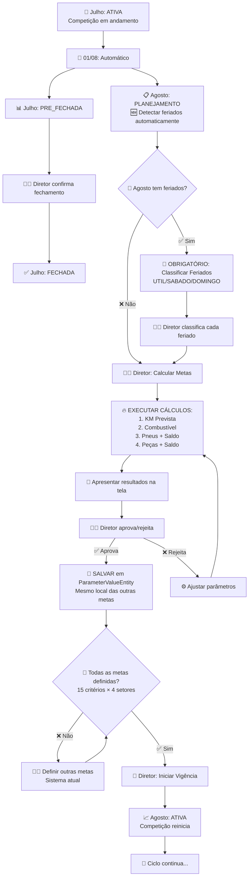
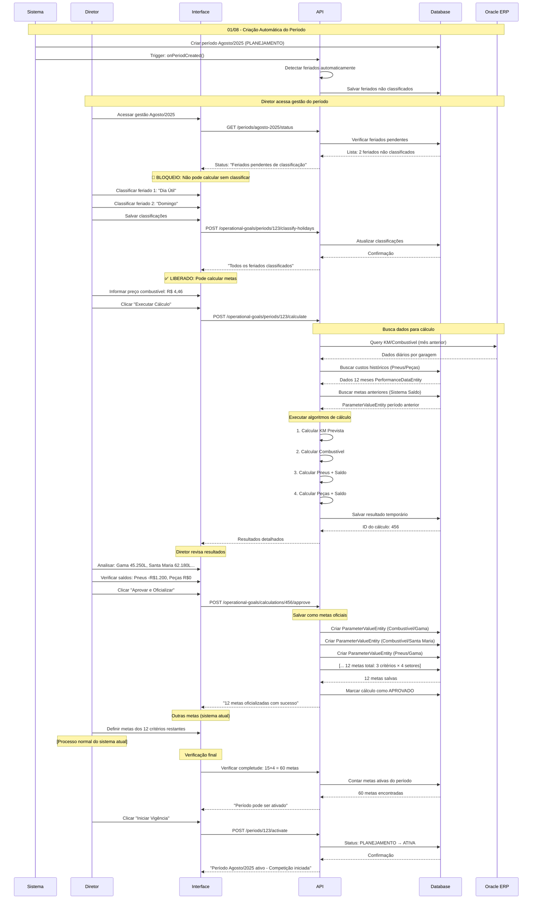
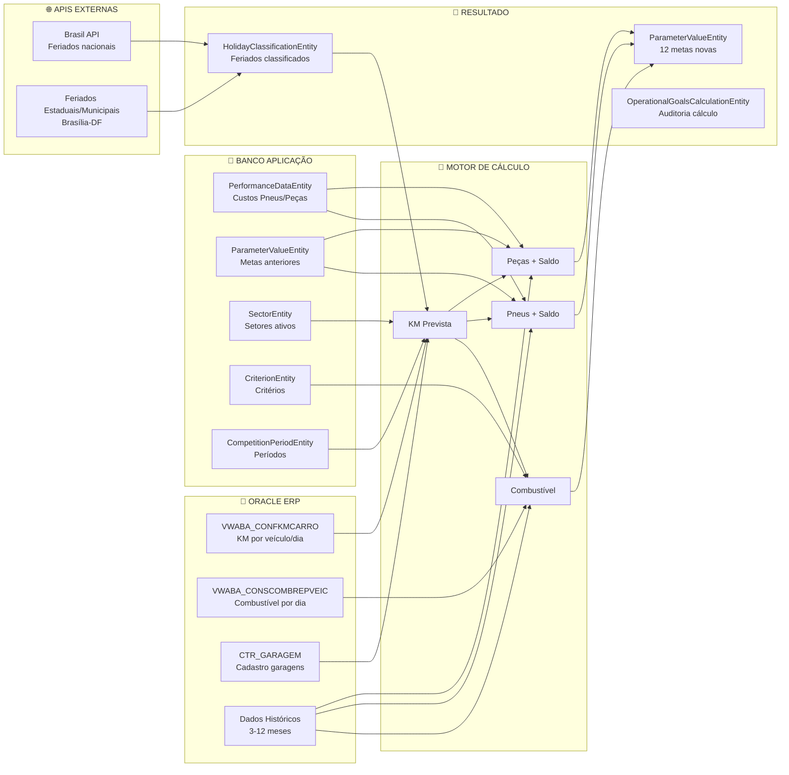
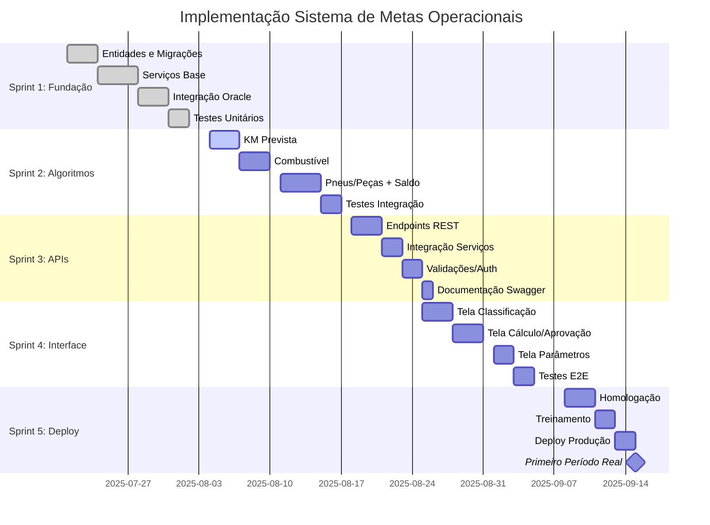

# 📋 **DOCUMENTAÇÃO TÉCNICA CORRIGIDA**

## **Sistema de Cálculo Automático de Metas Operacionais**

**Versão:** 2.0 (Revisada)  
**Data:** 17 de julho de 2025  
**Objetivo:** Automatizar o cálculo de metas para COMBUSTÍVEL, PNEUS e PEÇAS aproveitando a infraestrutura existente da API

---

## 📑 **ÍNDICE**

1. [Visão Geral do Sistema](#1-visão-geral-do-sistema)
2. [Integração com Arquitetura Existente](#2-integração-com-arquitetura-existente)
3. [Mapeamento de Fontes de Dados Reais](#3-mapeamento-de-fontes-de-dados-reais)
4. [Algoritmos de Cálculo](#4-algoritmos-de-cálculo)
5. [Implementação Baseada na API Real](#5-implementação-baseada-na-api-real)
6. [APIs e Endpoints](#6-apis-e-endpoints)
7. [Interface Gerencial](#7-interface-gerencial)
8. [Cronograma de Implementação](#8-cronograma-de-implementação)

---

## 1. **VISÃO GERAL DO SISTEMA**

### **1.1 Escopo da Funcionalidade**

- **Critérios Afetados:** COMBUSTÍVEL, PNEUS e PEÇAS (3 de 15 critérios totais)
- **Outros Critérios:** Mantêm o sistema de pré-cálculo atual (12 critérios restantes)
- **Fonte Principal:** Será a **única fonte oficial** para definir metas destes 3 critérios
- **Aprovação:** Metas são apresentadas para aprovação gerencial antes da oficialização

### **1.2 Integração com Sistema Existente**

- **✅ Aproveitar:** `CompetitionPeriodEntity` com status PLANEJAMENTO → ATIVA
- **✅ Aproveitar:** `ParameterValueEntity` para salvar metas calculadas
- **✅ Aproveitar:** `OracleEtlService` e Raw Entities existentes
- **✅ Aproveitar:** Sistema de auditoria `AuditLogEntity`
- **🆕 Adicionar:** Apenas funcionalidades específicas necessárias

---

## 2. **INTEGRAÇÃO COM ARQUITETURA EXISTENTE**

### **2.1 Aproveitamento da Infraestrutura Atual**

```
PLANEJAMENTO → ATIVA → PRE_FECHADA → FECHADA
```

#### **✅ Sistema ETL Oracle - JÁ FUNCIONAL**

```typescript
// USAR O QUE JÁ EXISTE:
export class OracleEtlService {
  // ✅ Conexão Oracle configurada
  // ✅ Mapeamento de garagens existente:
  if (item.CODIGOGA == '31') sectorName = 'PARANOÁ';
  else if (item.CODIGOGA == '124') sectorName = 'SANTA MARIA';
  else if (item.CODIGOGA == '239') sectorName = 'SÃO SEBASTIÃO';
  else if (item.CODIGOGA == '240') sectorName = 'GAMA';

  // ✅ Raw Entities já criadas e funcionais
}

// 🆕 ESTENDER (não duplicar):
export class OperationalGoalsOracleService extends OracleEtlService {
  // Apenas queries específicas para metas operacionais
  async fetchDailyKmAndFuelForGoals(startDate: string, endDate: string): Promise<OracleKmFuelData[]>
  async fetchHistorical3MonthsForGoals(sectorCode: string): Promise<HistoricalFuelData[]>
}
```

#### **✅ Sistema de Parâmetros - USAR EXISTENTE**

```typescript
// ✅ USAR ParameterValueEntity EXISTENTE para metas:
const metaCombustivel = await parameterService.createParameter({
  criterionId: combustivelCriterion.id,
  sectorId: gamaSetor.id,
  competitionPeriodId: agosto2025.id,
  valor: '45250.75', // Meta calculada em litros
  justificativa: 'Meta automática operacional',
  metadata: {
    isOperationalGoal: true,
    calculationId: 123,
  },
});

// 🆕 ADICIONAR APENAS para parâmetros de configuração globais:
@Entity('operational_goals_parameters')
export class OperationalGoalsParametersEntity {
  @PrimaryGeneratedColumn()
  id!: number;

  @Column('varchar', { length: 100, unique: true })
  parameterName!: string; // 'FATOR_REDUCAO_COMBUSTIVEL'

  @Column('decimal', { precision: 10, scale: 6 })
  value!: number; // 0.015

  @Column('text')
  description!: string;
}
```

#### **✅ Raw Data - APROVEITAR EXISTENTES**

```typescript
// ✅ JÁ EXISTE e FUNCIONA:
@Entity({ name: 'raw_oracle_fleet_performance' })
export class RawOracleFleetPerformanceEntity {
  metricMonth!: string; // '2025-07'
  sectorName!: string; // 'SANTA MARIA'
  totalKm!: number; // KM do mês
  totalFuelLiters!: number; // Litros do mês
  avgKmL!: number; // Eficiência média
}

// 🆕 USAR DIRETAMENTE para cálculos históricos
// ❌ NÃO criar novas Raw Entities desnecessárias
```

### **2.2 Mapeamento Real de Setores**



#### **❌ CORREÇÃO: Campo erpId NÃO EXISTE**

```typescript
// ✅ REALIDADE da SectorEntity:
@Entity({ name: 'sectors' })
export class SectorEntity {
  @PrimaryGeneratedColumn()
  id!: number;

  @Column({ type: 'varchar', length: 255, unique: true })
  nome!: string; // 'GAMA', 'PARANOÁ', etc.

  @Column({ type: 'boolean', default: true })
  ativo!: boolean;

  // ❌ NÃO TEM: erpId
}

// ✅ SOLUÇÃO: Usar mapeamento por nome (como já existe no ETL)
export class SectorMappingService {
  private readonly ORACLE_TO_SECTOR_MAPPING = {
    'GARAGEM GAMA': 'GAMA',
    'GARAGEM PARANOA': 'PARANOÁ',
    'GARAGEM SANTA MARIA': 'SANTA MARIA',
    'GARAGEM SAO SEBASTIAO': 'SÃO SEBASTIÃO',
  };

  async mapOracleToSector(
    oracleGarageName: string
  ): Promise<SectorEntity | null> {
    const sectorName = this.ORACLE_TO_SECTOR_MAPPING[oracleGarageName];
    if (!sectorName) return null;

    return await this.sectorRepo.findOne({ where: { nome: sectorName } });
  }
}
```

### **2.3 Sequência de Ações Detalhada**



---

## 3. **MAPEAMENTO DE FONTES DE DADOS REAIS**

### **3.1 Dados Já Disponíveis na API**

| Dado Necessário              | Fonte Real na API          | Status           |
| ---------------------------- | -------------------------- | ---------------- |
| **KM diário por garagem**    | Query Oracle (nova)        | 🆕 A implementar |
| **Combustível diário**       | Query Oracle (nova)        | 🆕 A implementar |
| **Custos Pneus (histórico)** | `PerformanceDataEntity`    | ✅ Disponível    |
| **Custos Peças (histórico)** | `PerformanceDataEntity`    | ✅ Disponível    |
| **Metas anteriores**         | `ParameterValueEntity`     | ✅ Disponível    |
| **Gasto real anterior**      | `PerformanceDataEntity`    | ✅ Disponível    |
| **Mapeamento Garagens**      | `SectorEntity.nome`        | ✅ Disponível    |
| **Feriados**                 | API Brasil + classificação | 🆕 A implementar |

### **3.2 Aproveitamento das Raw Entities Existentes**

#### **Para Dados Históricos (3-12 meses):**

```typescript
// ✅ USAR: RawOracleFleetPerformanceEntity EXISTENTE
async getHistoricalFuelEfficiency(sectorName: string, monthsBack: number = 3): Promise<HistoricalData[]> {
  return await this.rawFleetPerformanceRepo.find({
    where: {
      sectorName,
      metricMonth: Between(startMonth, endMonth)
    },
    order: { metricMonth: 'ASC' }
  });
}

// ✅ USAR: PerformanceDataEntity EXISTENTE
async getHistoricalCosts(criterionName: 'PNEUS' | 'PEÇAS', monthsBack: number = 12): Promise<CostData[]> {
  const criterion = await this.criterionRepo.findOne({ where: { nome: criterionName } });

  return await this.performanceDataRepo.find({
    where: {
      criterionId: criterion.id,
      metricDate: Between(startDate, endDate)
    },
    relations: ['setor']
  });
}
```

### **3.3 Query Oracle Real - Integrada ao ETL Existente**

```typescript
// 🆕 ESTENDER OracleEtlService EXISTENTE:
export class OperationalGoalsOracleService extends OracleEtlService {
  async fetchDailyKmAndFuelForGoals(
    startDate: string,
    endDate: string
  ): Promise<OracleKmFuelData[]> {
    // ✅ Usar conexão Oracle existente
    const query = `
      SELECT
        A.NOMEGA,
        ROUND(A.QNTCOMB, 2) AS QNTCOMB,        
        A.KM,
        ROUND((A.KM / A.QNTCOMB), 2) AS KMLITRO,
        A.DATAABASTCARRO
      FROM (
        SELECT
          B.NOMEGA,
          B.DATAABASTCARRO,
          SUM(B.QNTCOMB) AS QNTCOMB,        
          SUM(B.KM) AS KM
        FROM (
          SELECT
            G.NOMEGA,
            C.DATAABASTCARRO,
            C.QTDECOMB AS QNTCOMB,        
            K.KMPERCORRIDOVELOC AS KM
          FROM VWABA_CONFKMCARRO K,
               FRT_CADVEICULOS V,
               VWABA_CONSCOMBREPVEIC C,
               CTR_GARAGEM G
          WHERE V.CODIGOVEIC = K.CODIGOVEIC
            AND V.CODIGOGA = G.CODIGOGA
            AND C.CODIGOVEIC = K.CODIGOVEIC
            AND K.DATAVELOC = C.DATAABASTCARRO
            AND C.SEQUENCIAABASTCARRO = K.SEQUENCIAVELOC    
            AND C.DATAABASTCARRO BETWEEN ? AND ?
            AND V.CODIGOEMPRESA = 4
            AND V.CODIGOGA BETWEEN 1 AND 9999
        ) B
        GROUP BY B.NOMEGA, B.DATAABASTCARRO
      ) A
      ORDER BY A.NOMEGA, A.DATAABASTCARRO ASC
    `;

    // ✅ Usar DataSource Oracle existente
    return await this.oracleDataSource.query(query, [startDate, endDate]);
  }
}
```

### **3.4 Fluxo de Dados Detalhado**



---

## 4. **ALGORITMOS DE CÁLCULO**

### **4.1 Serviço Principal de Cálculo**

```typescript
export class OperationalGoalsCalculationService {
  constructor(
    // ✅ Aproveitar serviços existentes
    private oracleEtlService: OracleEtlService,
    private parameterService: ParameterService,
    private performanceDataRepo: Repository<PerformanceDataEntity>,
    private sectorMappingService: SectorMappingService,

    // 🆕 Apenas serviços específicos novos
    private holidayService: HolidayManagementService,
    private operationalOracleService: OperationalGoalsOracleService
  ) {}

  async executeFullCalculation(
    competitionPeriodId: number,
    userId: number
  ): Promise<CalculationResult> {
    // 1. Validar pré-requisitos usando estruturas existentes
    await this.validatePrerequisites(competitionPeriodId);

    // 2. Buscar setores ativos (entidade existente)
    const activeSectors = await this.sectorRepo.find({
      where: { ativo: true },
    });

    // 3. Executar cálculos para cada setor
    const results = {};

    for (const sector of activeSectors) {
      // KM Prevista
      const kmResult = await this.calculateKmPrevista(
        competitionPeriodId,
        sector
      );

      // Combustível (usando Raw Data existente)
      const combustivelResult = await this.calculateCombustivel(
        kmResult,
        sector
      );

      // Pneus (usando PerformanceDataEntity existente)
      const pneusResult = await this.calculatePneusPecas(
        kmResult,
        sector,
        'PNEUS'
      );

      // Peças (usando PerformanceDataEntity existente)
      const pecasResult = await this.calculatePneusPecas(
        kmResult,
        sector,
        'PEÇAS'
      );

      results[sector.id] = {
        kmPrevista: kmResult,
        combustivel: combustivelResult,
        pneus: pneusResult,
        pecas: pecasResult,
      };
    }

    return {
      competitionPeriodId,
      results,
      calculatedAt: new Date(),
      calculatedBy: userId,
    };
  }

  private async calculateKmPrevista(
    competitionPeriodId: number,
    sector: SectorEntity
  ): Promise<KmPrevistaResult> {
    // 1. Buscar período para determinar mês de referência
    const period = await this.periodRepo.findOne({
      where: { id: competitionPeriodId },
    });
    const referenceMonth = this.getPreviousMonth(period.mesAno);

    // 2. Buscar dados Oracle usando serviço estendido
    const oracleData =
      await this.operationalOracleService.fetchDailyKmAndFuelForGoals(
        `${referenceMonth}-01`,
        `${referenceMonth}-31`
      );

    // 3. Filtrar dados do setor usando mapeamento real
    const sectorData = oracleData.filter((d) => {
      const mappedSector = this.sectorMappingService.mapOracleToSectorSync(
        d.NOMEGA
      );
      return mappedSector?.id === sector.id;
    });

    // 4. Analisar padrões e projetar
    const averages = this.analyzeDailyPatterns(sectorData);
    const projection = await this.projectFutureMonth(
      averages,
      period.mesAno,
      competitionPeriodId
    );

    return {
      sectorId: sector.id,
      sectorName: sector.nome,
      projectedKm: projection.totalKm,
      calculationDetails: {
        referenceMonth,
        dailyAverages: averages,
        futureCalendar: projection.calendar,
      },
    };
  }

  private async calculateCombustivel(
    kmResult: KmPrevistaResult,
    sector: SectorEntity
  ): Promise<CombustivelResult> {
    // ✅ Usar Raw Data existente para histórico
    const historical = await this.rawFleetPerformanceRepo.find({
      where: {
        sectorName: sector.nome,
        metricMonth: Between(this.getMonthsAgo(3), this.getLastMonth()),
      },
    });

    // Calcular média de eficiência
    const totalKm = historical.reduce((sum, month) => sum + month.totalKm, 0);
    const totalLiters = historical.reduce(
      (sum, month) => sum + month.totalFuelLiters,
      0
    );
    const avgKmPerLiter = totalKm / totalLiters;

    // Buscar parâmetro de redução
    const fatorReducao = await this.getOperationalParameter(
      'FATOR_REDUCAO_COMBUSTIVEL'
    );

    // Calcular meta
    const litrosPrevistoBruto = kmResult.projectedKm / avgKmPerLiter;
    const metaLitros = litrosPrevistoBruto * (1 - fatorReducao);

    return {
      sectorId: sector.id,
      kmPrevista: kmResult.projectedKm,
      historical3Months: {
        totalKm,
        totalLiters,
        avgKmPerLiter,
      },
      fatorReducao,
      metaLitros,
      calculationDetails: {
        litrosPrevistoBruto,
        reductionApplied: litrosPrevistoBruto * fatorReducao,
      },
    };
  }

  private async calculatePneusPecas(
    kmResult: KmPrevistaResult,
    sector: SectorEntity,
    criterionType: 'PNEUS' | 'PEÇAS'
  ): Promise<PneusPecasResult> {
    // ✅ Usar PerformanceDataEntity existente para custos históricos
    const criterion = await this.criterionRepo.findOne({
      where: { nome: criterionType },
    });
    const historicalCosts = await this.performanceDataRepo.find({
      where: {
        criterionId: criterion.id,
        sectorId: sector.id,
        metricDate: Between(this.getMonthsAgo(12), this.getLastMonth()),
      },
    });

    // Calcular custo médio por KM
    const totalCost12M = historicalCosts.reduce(
      (sum, month) => sum + (month.valor || 0),
      0
    );
    const totalKm12M = await this.getTotalKmFor12Months(sector.id);
    const avgCostPerKm = totalCost12M / totalKm12M;

    // Calcular meta base
    const custoPrevistoKm = kmResult.projectedKm * avgCostPerKm;
    const percentualPremiacao = await this.getOperationalParameter(
      `PERCENTUAL_PREMIACAO_${criterionType}`
    );
    const metaBase = custoPrevistoKm * (1 - percentualPremiacao);

    // Calcular saldo devedor usando ParameterValueEntity existente
    const saldoDevedor = await this.calculateSaldoDevedor(
      sector.id,
      criterionType,
      kmResult.competitionPeriodId
    );

    return {
      sectorId: sector.id,
      criterionType,
      kmPrevista: kmResult.projectedKm,
      annualCostData: {
        totalKm12Months: totalKm12M,
        totalCost12Months: totalCost12M,
        avgCostPerKm,
      },
      metaBase,
      saldoDevedor,
      metaFinal: metaBase - saldoDevedor,
      calculationDetails: {
        custoPrevistoKm,
        percentualPremiacao,
        reductionApplied: custoPrevistoKm * percentualPremiacao,
      },
    };
  }

  private async calculateSaldoDevedor(
    sectorId: number,
    criterionType: 'PNEUS' | 'PEÇAS',
    currentPeriodId: number
  ): Promise<number> {
    // ✅ Buscar meta anterior usando ParameterValueEntity existente
    const previousPeriod = await this.getPreviousPeriod(currentPeriodId);
    if (!previousPeriod) return 0;

    const criterion = await this.criterionRepo.findOne({
      where: { nome: criterionType },
    });

    const metaAnterior = await this.parameterRepo.findOne({
      where: {
        competitionPeriodId: previousPeriod.id,
        sectorId,
        criterionId: criterion.id,
        dataFimEfetivo: IsNull(),
      },
    });

    // ✅ Buscar gasto real usando PerformanceDataEntity existente
    const gastoReal = await this.performanceDataRepo.findOne({
      where: {
        competitionPeriodId: previousPeriod.id,
        sectorId,
        criterionId: criterion.id,
      },
    });

    if (!metaAnterior || !gastoReal) return 0;

    // Calcular saldo
    const metaAprovada = parseFloat(metaAnterior.valor);
    const gastoRealizado = gastoReal.valor || 0;
    const tolerancia = await this.getOperationalParameter(
      'PERCENTUAL_TOLERANCIA_SALDO'
    );
    const tetoGasto = metaAprovada * (1 + tolerancia);

    return gastoRealizado > tetoGasto ? gastoRealizado - tetoGasto : 0;
  }
}
```

---

## 5. **IMPLEMENTAÇÃO BASEADA NA API REAL**

### **5.1 Novas Entidades Necessárias (Mínimas)**

```typescript
// 🆕 ÚNICA entidade nova realmente necessária para feriados
@Entity('holiday_classifications')
export class HolidayClassificationEntity {
  @PrimaryGeneratedColumn()
  id!: number;

  @Column('date')
  holidayDate!: string;

  @Column('varchar', { length: 100 })
  holidayName!: string;

  @Column({
    type: 'varchar',
    enum: ['UTIL', 'SABADO', 'DOMINGO_FERIADO'],
  })
  classification!: 'UTIL' | 'SABADO' | 'DOMINGO_FERIADO';

  @Column()
  competitionPeriodId!: number;

  @ManyToOne(() => CompetitionPeriodEntity, { onDelete: 'CASCADE' })
  @JoinColumn({ name: 'competitionPeriodId' })
  competitionPeriod!: CompetitionPeriodEntity;

  @Column()
  classifiedBy!: number;

  @CreateDateColumn()
  classifiedAt!: Date;
}

// 🆕 Para parâmetros de configuração globais (separados das metas)
@Entity('operational_goals_parameters')
export class OperationalGoalsParametersEntity {
  @PrimaryGeneratedColumn()
  id!: number;

  @Column('varchar', { length: 100, unique: true })
  parameterName!: string; // 'FATOR_REDUCAO_COMBUSTIVEL'

  @Column('decimal', { precision: 10, scale: 6 })
  value!: number; // 0.015

  @Column('text')
  description!: string;

  @Column('text', { nullable: true })
  changeJustification?: string;

  @UpdateDateColumn()
  updatedAt!: Date;

  @Column()
  updatedBy!: number;
}

// 🆕 Para armazenar resultados temporários de cálculo (antes da aprovação)
@Entity('operational_goals_calculations')
export class OperationalGoalsCalculationEntity {
  @PrimaryGeneratedColumn()
  id!: number;

  @Column()
  competitionPeriodId!: number;

  @Column('jsonb')
  calculationData!: any; // Resultados completos

  @Column({
    type: 'varchar',
    enum: ['PENDING', 'COMPLETED', 'APPROVED', 'REJECTED'],
    default: 'COMPLETED',
  })
  status!: string;

  @Column()
  calculatedBy!: number;

  @CreateDateColumn()
  calculatedAt!: Date;

  @Column({ nullable: true })
  approvedBy?: number;

  @Column({ type: 'timestamp with time zone', nullable: true })
  approvedAt?: Date;
}
```

### **5.2 Extensão de Serviços Existentes**

```typescript
// ✅ ESTENDER ParameterService EXISTENTE (não substituir)
export class ParameterService {
  // ... todos os métodos existentes ...

  /**
   * 🆕 Método específico para salvar metas operacionais
   */
  async saveOperationalGoalsMetas(
    calculationId: number,
    userId: number
  ): Promise<ParameterValueEntity[]> {
    const calculation = await this.calculationRepo.findOne({
      where: { id: calculationId },
    });
    const savedParameters: ParameterValueEntity[] = [];

    // ✅ Usar createParameter() EXISTENTE
    for (const [sectorId, results] of Object.entries(
      calculation.calculationData
    )) {
      // COMBUSTÍVEL
      const combustivelParam = await this.createParameter(
        {
          criterionId: await this.getCriterionId('COMBUSTÍVEL'),
          sectorId: parseInt(sectorId),
          competitionPeriodId: calculation.competitionPeriodId,
          valor: results.combustivel.metaLitros.toString(),
          dataInicioEfetivo: calculation.period.dataInicio,
          justificativa: `Meta automática operacional - Cálculo ID: ${calculationId}`,
          metadata: {
            calculationId,
            isOperationalGoal: true,
            algorithm: 'operational_goals_v2.0',
          },
        },
        await this.getUserById(userId)
      );

      savedParameters.push(combustivelParam);

      // PNEUS e PEÇAS seguem mesmo padrão...
    }

    return savedParameters;
  }
}

// 🆕 NOVO serviço específico para feriados
export class HolidayManagementService {
  async detectHolidaysForPeriod(
    competitionPeriodId: number
  ): Promise<Holiday[]> {
    const period = await this.periodRepo.findOne({
      where: { id: competitionPeriodId },
    });
    const [year, month] = period.mesAno.split('-');

    // Buscar na API Brasil
    const holidays = await this.fetchHolidaysFromBrasilAPI(year, month);

    // Salvar como não classificados
    for (const holiday of holidays) {
      await this.holidayRepo.save({
        holidayDate: holiday.date,
        holidayName: holiday.name,
        competitionPeriodId,
        classification: null, // Aguardando classificação
      });
    }

    return holidays;
  }

  async requiresClassification(competitionPeriodId: number): Promise<boolean> {
    const unclassified = await this.holidayRepo.count({
      where: {
        competitionPeriodId,
        classification: IsNull(),
      },
    });

    return unclassified > 0;
  }
}
```

### **5.3 Integração com Workflow Existente**

```typescript
// ✅ USAR CompetitionPeriodService EXISTENTE
export class CompetitionPeriodService {
  // ... métodos existentes ...

  /**
   * 🆕 Hook para detecção automática de feriados
   */
  async onPeriodCreated(newPeriod: CompetitionPeriodEntity): Promise<void> {
    if (newPeriod.status === 'PLANEJAMENTO') {
      // 🆕 Detectar feriados automaticamente
      await this.holidayService.detectHolidaysForPeriod(newPeriod.id);
    }
  }

  /**
   * ✅ ESTENDER validação existente
   */
  async canActivatePeriod(
    competitionPeriodId: number
  ): Promise<ValidationResult> {
    // ✅ Validação existente (todas as metas definidas)
    const baseValidation =
      await this.validateAllGoalsDefined(competitionPeriodId);

    if (!baseValidation.canActivate) {
      return baseValidation;
    }

    // 🆕 Validação adicional (feriados classificados se houver)
    const hasUnclassifiedHolidays =
      await this.holidayService.requiresClassification(competitionPeriodId);

    if (hasUnclassifiedHolidays) {
      return {
        canActivate: false,
        message: 'Existem feriados não classificados para este período',
      };
    }

    return baseValidation;
  }
}
```

---

## 6. **APIs E ENDPOINTS**

### **6.1 Rotas Específicas Novas**

```typescript
// apps/api/src/routes/operational-goals.routes.ts
const operationalGoalsRoutes: FastifyPluginAsync = async (fastify) => {
  /**
   * GET /api/operational-goals/periods/:periodId/holidays-status
   * Verificar status de feriados
   */
  fastify.get<{ Params: { periodId: string } }>(
    '/api/operational-goals/periods/:periodId/holidays-status',
    {
      preHandler: [fastify.authenticate],
      schema: {
        description: 'Verificar status de classificação de feriados',
        tags: ['Operational Goals'],
      },
    },
    async (request, reply) => {
      const periodId = parseInt(request.params.periodId);

      const holidays =
        await fastify.services.holidayManagement.getHolidaysForPeriod(periodId);
      const hasUnclassified =
        await fastify.services.holidayManagement.requiresClassification(
          periodId
        );

      return {
        hasUnclassifiedHolidays: hasUnclassified,
        holidays: holidays.map((h) => ({
          date: h.holidayDate,
          name: h.holidayName,
          isClassified: !!h.classification,
          classification: h.classification,
        })),
      };
    }
  );

  /**
   * POST /api/operational-goals/periods/:periodId/classify-holidays
   * Classificar feriados (somente diretores)
   */
  fastify.post<{
    Params: { periodId: string };
    Body: { classifications: Array<{ date: string; classification: string }> };
  }>(
    '/api/operational-goals/periods/:periodId/classify-holidays',
    {
      preHandler: [fastify.authenticate, requireDirectorRole],
      schema: {
        description: 'Classificar feriados (somente diretores)',
        tags: ['Operational Goals'],
      },
    },
    async (request, reply) => {
      const periodId = parseInt(request.params.periodId);
      const { classifications } = request.body;
      const userId = request.user.id;
      await fastify.services.holidayManagement.saveClassifications(
        periodId,
        classifications,
        userId
      );

      return {
        success: true,
        message: 'Feriados classificados com sucesso',
      };
    }
  );

  /**
   * POST /api/operational-goals/periods/:periodId/calculate
   * Executar cálculo automático (somente diretores)
   */
  fastify.post<{
    Params: { periodId: string };
    Body: { precoCombustivel?: number };
  }>(
    '/api/operational-goals/periods/:periodId/calculate',
    {
      preHandler: [fastify.authenticate, requireDirectorRole],
      schema: {
        description: 'Executar cálculo automático de metas',
        tags: ['Operational Goals'],
      },
    },
    async (request, reply) => {
      const periodId = parseInt(request.params.periodId);
      const userId = request.user.id;
      const { precoCombustivel } = request.body;

      try {
        const calculation =
          await fastify.services.operationalGoalsCalculation.executeFullCalculation(
            periodId,
            userId
          );

        // Aplicar preço do combustível se fornecido
        if (precoCombustivel) {
          calculation.fuelPriceUsed = precoCombustivel;
          // Recalcular projeções financeiras
          for (const sectorResult of Object.values(calculation.results)) {
            sectorResult.combustivel.metaReais =
              sectorResult.combustivel.metaLitros * precoCombustivel;
          }
        }

        return {
          calculationId: calculation.id,
          status: 'COMPLETED',
          results: calculation.results,
          summary: {
            sectorsProcessed: Object.keys(calculation.results).length,
            criteriaCalculated: ['COMBUSTÍVEL', 'PNEUS', 'PEÇAS'],
            calculatedAt: calculation.calculatedAt,
          },
        };
      } catch (error) {
        if (error.message === 'HOLIDAYS_NOT_CLASSIFIED') {
          return reply.status(400).send({
            error: 'Feriados não classificados',
            code: 'HOLIDAYS_NOT_CLASSIFIED',
          });
        }

        if (error.message === 'PERIOD_NOT_IN_PLANNING') {
          return reply.status(400).send({
            error: 'Período não está em planejamento',
            code: 'PERIOD_NOT_IN_PLANNING',
          });
        }

        throw error;
      }
    }
  );

  /**
   * POST /api/operational-goals/calculations/:calculationId/approve
   * Aprovar e oficializar metas (somente diretores)
   */
  fastify.post<{
    Params: { calculationId: string };
    Body: { observations?: string };
  }>(
    '/api/operational-goals/calculations/:calculationId/approve',
    {
      preHandler: [fastify.authenticate, requireDirectorRole],
      schema: {
        description: 'Aprovar cálculo e oficializar como metas',
        tags: ['Operational Goals'],
      },
    },
    async (request, reply) => {
      const calculationId = parseInt(request.params.calculationId);
      const userId = request.user.id;
      const { observations } = request.body;

      // ✅ Usar ParameterService EXISTENTE para salvar metas
      const savedParameters =
        await fastify.services.parameter.saveOperationalGoalsMetas(
          calculationId,
          userId
        );

      // Marcar cálculo como aprovado
      await fastify.services.operationalGoalsCalculation.approveCalculation(
        calculationId,
        userId,
        observations
      );

      return {
        success: true,
        message: 'Metas aprovadas e oficializadas no sistema',
        savedGoals: savedParameters.length,
        details: savedParameters.map((param) => ({
          criterion: param.criterion?.nome,
          sector: param.setor?.nome,
          value: param.valor,
          effectiveDate: param.dataInicioEfetivo,
        })),
      };
    }
  );

  /**
   * GET /api/operational-goals/parameters
   * Buscar parâmetros configuráveis
   */
  fastify.get(
    '/api/operational-goals/parameters',
    {
      preHandler: [fastify.authenticate],
      schema: {
        description: 'Buscar parâmetros configuráveis do sistema',
        tags: ['Operational Goals - Parameters'],
      },
    },
    async (request, reply) => {
      const parameters =
        await fastify.services.operationalGoalsParameters.getAllParameters();

      return {
        parameters: parameters.reduce((acc, param) => {
          acc[param.parameterName] = {
            value: param.value,
            description: param.description,
            lastUpdated: param.updatedAt,
            updatedBy: param.updatedByUser?.nome,
          };
          return acc;
        }, {}),
        lastCheck: new Date().toISOString(),
      };
    }
  );

  /**
   * PUT /api/operational-goals/parameters/:parameterName
   * Atualizar parâmetro (somente diretores)
   */
  fastify.put<{
    Params: { parameterName: string };
    Body: { value: number; justification: string };
  }>(
    '/api/operational-goals/parameters/:parameterName',
    {
      preHandler: [fastify.authenticate, requireDirectorRole],
      schema: {
        description: 'Atualizar parâmetro de cálculo',
        tags: ['Operational Goals - Parameters'],
        body: {
          type: 'object',
          properties: {
            value: { type: 'number', minimum: 0, maximum: 1 },
            justification: { type: 'string', minLength: 10, maxLength: 500 },
          },
          required: ['value', 'justification'],
        },
      },
    },
    async (request, reply) => {
      const { parameterName } = request.params;
      const { value, justification } = request.body;
      const userId = request.user.id;

      const updatedParameter =
        await fastify.services.operationalGoalsParameters.updateParameter(
          parameterName,
          value,
          justification,
          userId
        );

      // ✅ Auditoria usando sistema existente
      await fastify.services.auditLog.createLog({
        userId,
        userName: request.user.nome,
        actionType: 'OPERATIONAL_PARAMETER_UPDATED',
        entityType: 'OperationalGoalsParametersEntity',
        entityId: updatedParameter.id.toString(),
        details: {
          parameterName,
          previousValue: updatedParameter.previousValue,
          newValue: value,
          justification,
        },
        justification,
      });

      return {
        success: true,
        parameter: {
          name: updatedParameter.parameterName,
          value: updatedParameter.value,
          description: updatedParameter.description,
          updatedAt: updatedParameter.updatedAt,
        },
      };
    }
  );

  /**
   * GET /api/operational-goals/calculations/:calculationId
   * Buscar detalhes de cálculo específico
   */
  fastify.get<{ Params: { calculationId: string } }>(
    '/api/operational-goals/calculations/:calculationId',
    {
      preHandler: [fastify.authenticate],
      schema: {
        description: 'Buscar detalhes de cálculo específico',
        tags: ['Operational Goals'],
      },
    },
    async (request, reply) => {
      const calculationId = parseInt(request.params.calculationId);

      const calculation =
        await fastify.services.operationalGoalsCalculation.getCalculationDetails(
          calculationId
        );

      if (!calculation) {
        return reply.status(404).send({
          error: 'Cálculo não encontrado',
        });
      }

      return calculation;
    }
  );

  fastify.log.info('✅ Rotas de Metas Operacionais registradas');
};

export default fp(operationalGoalsRoutes, {
  name: 'operational-goals-routes',
});
```

### **6.2 Integração com Sistema de Serviços Existente**

```typescript
// apps/api/src/plugins/services.ts - ATUALIZADO
import { OperationalGoalsCalculationService } from '@/modules/operational-goals/calculation.service';
import { HolidayManagementService } from '@/modules/operational-goals/holiday.service';
import { OperationalGoalsParametersService } from '@/modules/operational-goals/parameters.service';

interface Services {
  // ✅ Serviços existentes
  ranking: RankingService;
  parameter: ParameterService;
  auditLog: AuditLogService;
  expurgo: ExpurgoService;
  competitionPeriod: CompetitionPeriodService;
  history: HistoryService;
  auth: AuthService;
  user: UserService;

  // 🆕 Novos serviços específicos
  operationalGoalsCalculation: OperationalGoalsCalculationService;
  holidayManagement: HolidayManagementService;
  operationalGoalsParameters: OperationalGoalsParametersService;
}

const servicesPlugin: FastifyPluginAsync = async (fastify: FastifyInstance) => {
  const services: Services = {
    // ✅ Instâncias existentes
    ranking: new RankingService(),
    parameter: new ParameterService(),
    auditLog: new AuditLogService(),
    expurgo: new ExpurgoService(),
    competitionPeriod: new CompetitionPeriodService(),
    history: new HistoryService(),
    auth: new AuthService(),
    user: new UserService(),

    // 🆕 Novas instâncias
    operationalGoalsCalculation: new OperationalGoalsCalculationService(),
    holidayManagement: new HolidayManagementService(),
    operationalGoalsParameters: new OperationalGoalsParametersService(),
  };

  fastify.decorate('services', services);

  fastify.log.info('✅ Todos os serviços registrados via dependency injection');
};
```

---

## 7. **INTERFACE GERENCIAL**

### **7.1 Integração com Tela de Gestão de Períodos Existente**

```typescript
// Aproveitar estrutura existente da tela de períodos
function PlanningPeriodManagement({ period }: { period: CompetitionPeriodEntity }) {
  const [holidaysStatus, setHolidaysStatus] = useState<HolidaysStatus>();
  const [calculationResult, setCalculationResult] = useState<CalculationResult>();
  const [parameters, setParameters] = useState<OperationalParameters>();

  // ✅ Usar hooks existentes onde possível
  const { parameters: currentGoals } = useParameters(period.mesAno);
  const { canActivate } = usePeriodValidation(period.id);

  return (
    <div className="period-management-container">

      {/* ✅ SEÇÕES EXISTENTES continuam iguais */}
      <PeriodStatusCard period={period} />

      {/* 🆕 NOVA SEÇÃO: Classificação de Feriados */}
      {period.status === 'PLANEJAMENTO' && (
        <HolidayClassificationSection
          period={period}
          holidaysStatus={holidaysStatus}
          onClassificationComplete={() => setHolidaysStatus({...holidaysStatus, allClassified: true})}
        />
      )}

      {/* 🆕 NOVA SEÇÃO: Cálculo de Metas Operacionais */}
      {period.status === 'PLANEJAMENTO' && holidaysStatus?.allClassified && (
        <OperationalGoalsCalculationSection
          period={period}
          onCalculationComplete={setCalculationResult}
          onGoalsApproved={handleGoalsApproved}
        />
      )}

      {/* ✅ SEÇÃO EXISTENTE: Outras Metas (12 critérios) */}
      <OtherGoalsSection
        period={period}
        existingGoals={currentGoals}
        excludeCriteria={['COMBUSTÍVEL', 'PNEUS', 'PEÇAS']} // 🆕 Excluir os 3 automáticos
      />

      {/* ✅ SEÇÃO EXISTENTE: Ativação do Período */}
      <PeriodActivationSection
        period={period}
        canActivate={canActivate}
        totalGoalsRequired={60} // 15 critérios × 4 setores
        currentGoalsDefined={getCurrentGoalsCount()}
      />

    </div>
  );
}

// 🆕 Componente específico para classificação de feriados
function HolidayClassificationSection({
  period,
  holidaysStatus,
  onClassificationComplete
}: HolidayClassificationSectionProps) {

  const [classifications, setClassifications] = useState<HolidayClassification[]>([]);
  const [isSaving, setIsSaving] = useState(false);

  const handleClassifyHoliday = (holidayDate: string, classification: string) => {
    setClassifications(prev =>
      prev.map(item =>
        item.date === holidayDate
          ? { ...item, classification }
          : item
      )
    );
  };

  const handleSaveClassifications = async () => {
    setIsSaving(true);

    try {
      await api.post(`/operational-goals/periods/${period.id}/classify-holidays`, {
        classifications: classifications.filter(c => c.classification)
      });

      toast.success('Feriados classificados com sucesso!');
      onClassificationComplete();

    } catch (error) {
      toast.error('Erro ao salvar classificações');
    } finally {
      setIsSaving(false);
    }
  };

  if (!holidaysStatus?.hasUnclassifiedHolidays) {
    return (
      <Card className="mb-6">
        <CardHeader>
          <CardTitle className="flex items-center gap-2">
            <CheckCircle className="text-green-500" />
            Feriados Classificados
          </CardTitle>
        </CardHeader>
        <CardContent>
          <p className="text-sm text-gray-600">
            Todos os feriados de {period.mesAno} foram classificados.
          </p>
        </CardContent>
      </Card>
    );
  }

  return (
    <Card className="mb-6 border-amber-200 bg-amber-50">
      <CardHeader>
        <CardTitle className="flex items-center gap-2">
          <AlertTriangle className="text-amber-500" />
          Classificação de Feriados Obrigatória
        </CardTitle>
        <CardDescription>
          Para calcular as metas operacionais, classifique os feriados de {period.mesAno} conforme operação planejada.
        </CardDescription>
      </CardHeader>
      <CardContent>
        <div className="space-y-4">
          {holidaysStatus.holidays.filter(h => !h.isClassified).map(holiday => (
            <div key={holiday.date} className="flex items-center justify-between p-3 border rounded-lg">
              <div>
                <div className="font-medium">{holiday.name}</div>
                <div className="text-sm text-gray-500">{formatDate(holiday.date)}</div>
              </div>
              <RadioGroup
                value={classifications.find(c => c.date === holiday.date)?.classification || ''}
                onValueChange={(value) => handleClassifyHoliday(holiday.date, value)}
                className="flex gap-4"
              >
                <div className="flex items-center space-x-2">
                  <RadioGroupItem value="UTIL" id={`${holiday.date}-util`} />
                  <Label htmlFor={`${holiday.date}-util`}>Dia Útil</Label>
                </div>
                <div className="flex items-center space-x-2">
                  <RadioGroupItem value="SABADO" id={`${holiday.date}-sabado`} />
                  <Label htmlFor={`${holiday.date}-sabado`}>Sábado</Label>
                </div>
                <div className="flex items-center space-x-2">
                  <RadioGroupItem value="DOMINGO_FERIADO" id={`${holiday.date}-domingo`} />
                  <Label htmlFor={`${holiday.date}-domingo`}>Domingo</Label>
                </div>
              </RadioGroup>
            </div>
          ))}

          <div className="flex justify-end pt-4">
            <Button
              onClick={handleSaveClassifications}
              disabled={isSaving || !allHolidaysClassified()}
              className="min-w-[150px]"
            >
              {isSaving ? (
                <>
                  <Loader2 className="mr-2 h-4 w-4 animate-spin" />
                  Salvando...
                </>
              ) : (
                <>
                  <Save className="mr-2 h-4 w-4" />
                  Salvar Classificações
                </>
              )}
            </Button>
          </div>
        </div>
      </CardContent>
    </Card>
  );
}

// 🆕 Componente específico para cálculo de metas
function OperationalGoalsCalculationSection({
  period,
  onCalculationComplete,
  onGoalsApproved
}: OperationalGoalsCalculationSectionProps) {

  const [fuelPrice, setFuelPrice] = useState<number>(0);
  const [isCalculating, setIsCalculating] = useState(false);
  const [calculationResult, setCalculationResult] = useState<CalculationResult | null>(null);

  const handleExecuteCalculation = async () => {
    setIsCalculating(true);

    try {
      const result = await api.post(`/operational-goals/periods/${period.id}/calculate`, {
        precoCombustivel: fuelPrice || undefined
      });

      setCalculationResult(result.data);
      onCalculationComplete(result.data);

      toast.success('Cálculo executado com sucesso!');

    } catch (error) {
      if (error.response?.data?.code === 'HOLIDAYS_NOT_CLASSIFIED') {
        toast.error('Classifique todos os feriados antes de calcular');
      } else {
        toast.error('Erro ao executar cálculo');
      }
    } finally {
      setIsCalculating(false);
    }
  };

  const handleApproveGoals = async () => {
    if (!calculationResult) return;

    try {
      await api.post(`/operational-goals/calculations/${calculationResult.calculationId}/approve`);

      toast.success('Metas aprovadas e oficializadas!');
      onGoalsApproved();

    } catch (error) {
      toast.error('Erro ao aprovar metas');
    }
  };

  return (
    <Card className="mb-6">
      <CardHeader>
        <CardTitle className="flex items-center gap-2">
          <Calculator className="text-blue-500" />
          Cálculo de Metas Operacionais
        </CardTitle>
        <CardDescription>
          Cálculo automático para COMBUSTÍVEL, PNEUS e PEÇAS baseado na metodologia oficial.
        </CardDescription>
      </CardHeader>
      <CardContent>

        {/* Input de preço do combustível */}
        <div className="mb-4">
          <Label htmlFor="fuel-price">
            Preço do Combustível por Litro (opcional - para projeção financeira)
          </Label>
          <Input
            id="fuel-price"
            type="number"
            step="0.001"
            placeholder="Ex: 4.462"
            value={fuelPrice || ''}
            onChange={(e) => setFuelPrice(parseFloat(e.target.value) || 0)}
            className="mt-1"
          />
        </div>

        {/* Botão de execução */}
        <div className="mb-4">
          <Button
            onClick={handleExecuteCalculation}
            disabled={isCalculating}
            className="w-full"
            size="lg"
          >
            {isCalculating ? (
              <>
                <Loader2 className="mr-2 h-4 w-4 animate-spin" />
                Executando Cálculos...
              </>
            ) : (
              <>
                <Calculator className="mr-2 h-4 w-4" />
                Executar Cálculo Automático
              </>
            )}
          </Button>
        </div>

        {/* Resultados */}
        {calculationResult && (
          <CalculationResultsDisplay
            result={calculationResult}
            onApprove={handleApproveGoals}
            onRecalculate={handleExecuteCalculation}
          />
        )}

      </CardContent>
    </Card>
  );
}
```

### **7.2 Tela de Configuração de Parâmetros**

```typescript
// 🆕 Nova página para configuração de parâmetros
function OperationalGoalsParametersPage() {
  const [parameters, setParameters] = useState<OperationalParameters>();
  const [editingParameter, setEditingParameter] = useState<string | null>(null);

  useEffect(() => {
    loadParameters();
  }, []);

  const loadParameters = async () => {
    try {
      const response = await api.get('/operational-goals/parameters');
      setParameters(response.data.parameters);
    } catch (error) {
      toast.error('Erro ao carregar parâmetros');
    }
  };

  const handleUpdateParameter = async (
    parameterName: string,
    value: number,
    justification: string
  ) => {
    try {
      await api.put(`/operational-goals/parameters/${parameterName}`, {
        value,
        justification
      });

      toast.success('Parâmetro atualizado com sucesso');
      await loadParameters();
      setEditingParameter(null);

    } catch (error) {
      toast.error('Erro ao atualizar parâmetro');
    }
  };

  return (
    <div className="max-w-4xl mx-auto p-6">
      <PageHeader
        title="Configuração de Parâmetros"
        description="Ajuste os percentuais utilizados no cálculo automático de metas operacionais"
      />

      <div className="grid gap-6 mt-6">

        <ParameterCard
          title="Combustível - Fator de Redução"
          description="Percentual de redução aplicado sobre a previsão bruta de consumo"
          parameterName="FATOR_REDUCAO_COMBUSTIVEL"
          currentValue={parameters?.FATOR_REDUCAO_COMBUSTIVEL}
          format="percentage"
          example="1.5% = meta será 1.5% menor que a previsão baseada no histórico"
          onUpdate={handleUpdateParameter}
          isEditing={editingParameter === 'FATOR_REDUCAO_COMBUSTIVEL'}
          onStartEdit={() => setEditingParameter('FATOR_REDUCAO_COMBUSTIVEL')}
          onCancelEdit={() => setEditingParameter(null)}
        />

        <ParameterCard
          title="Pneus - Percentual de Premiação"
          description="Desconto aplicado na meta base como incentivo de eficiência"
          parameterName="PERCENTUAL_PREMIACAO_PNEUS"
          currentValue={parameters?.PERCENTUAL_PREMIACAO_PNEUS}
          format="percentage"
          example="3% = meta será 3% menor que o custo previsto baseado no histórico"
          onUpdate={handleUpdateParameter}
          isEditing={editingParameter === 'PERCENTUAL_PREMIACAO_PNEUS'}
          onStartEdit={() => setEditingParameter('PERCENTUAL_PREMIACAO_PNEUS')}
          onCancelEdit={() => setEditingParameter(null)}
        />

        <ParameterCard
          title="Peças - Percentual de Premiação"
          description="Desconto aplicado na meta base como incentivo de eficiência"
          parameterName="PERCENTUAL_PREMIACAO_PECAS"
          currentValue={parameters?.PERCENTUAL_PREMIACAO_PECAS}
          format="percentage"
          example="3% = meta será 3% menor que o custo previsto baseado no histórico"
          onUpdate={handleUpdateParameter}
          isEditing={editingParameter === 'PERCENTUAL_PREMIACAO_PECAS'}
          onStartEdit={() => setEditingParameter('PERCENTUAL_PREMIACAO_PECAS')}
          onCancelEdit={() => setEditingParameter(null)}
        />

        <ParameterCard
          title="Sistema de Saldo - Tolerância"
          description="Tolerância sobre a meta antes de gerar saldo devedor para o próximo mês"
          parameterName="PERCENTUAL_TOLERANCIA_SALDO"
          currentValue={parameters?.PERCENTUAL_TOLERANCIA_SALDO}
          format="percentage"
          example="8% = gasto até 8% acima da meta não gera saldo devedor"
          onUpdate={handleUpdateParameter}
          isEditing={editingParameter === 'PERCENTUAL_TOLERANCIA_SALDO'}
          onStartEdit={() => setEditingParameter('PERCENTUAL_TOLERANCIA_SALDO')}
          onCancelEdit={() => setEditingParameter(null)}
        />

      </div>
    </div>
  );
}
```

---

## 8. **CRONOGRAMA DE IMPLEMENTAÇÃO CORRIGIDO**

### **🚀 Sprint 1: Fundação com Infraestrutura Existente (Semanas 1-2)**

#### **Objetivos:**

- Aproveitar máximo da infraestrutura atual
- Adicionar apenas funcionalidades realmente novas
- Integrar com serviços existentes

#### **Entregas:**

```
✅ Entidades mínimas necessárias:
   - HolidayClassificationEntity (nova)
   - OperationalGoalsParametersEntity (nova)
   - OperationalGoalsCalculationEntity (nova)

✅ Extensão de serviços existentes:
   - ParameterService.saveOperationalGoalsMetas() (método novo)
   - CompetitionPeriodService.onPeriodCreated() (hook novo)

✅ Novos serviços específicos:
   - HolidayManagementService
   - OperationalGoalsCalculationService
   - OperationalGoalsParametersService
   - OperationalGoalsOracleService (extende OracleEtlService)

✅ Integração com Brasil API (feriados)

✅ Mapeamento real por nome de setores

✅ Query Oracle específica para KM e combustível

✅ Migrações de banco de dados

✅ Testes unitários dos serviços novos
```

#### **Critérios de Aceite:**

- ✅ Detecção automática de feriados funcional
- ✅ Mapeamento de setores Oracle→App funcional
- ✅ Query Oracle retornando dados históricos
- ✅ Parâmetros configuráveis salvando corretamente

### **🔥 Sprint 2: Algoritmos de Cálculo (Semanas 3-4)**

#### **Objetivos:**

- Implementar lógica específica de cálculo
- Usar dados das Raw Entities existentes
- Integrar com PerformanceDataEntity atual

#### **Entregas:**

```
✅ Algoritmos implementados:
   - calculateKmPrevista() - com classificação de feriados
   - calculateCombustivel() - usando RawOracleFleetPerformanceEntity
   - calculatePneusPecas() - usando PerformanceDataEntity
   - Sistema de Saldo - usando ParameterValueEntity existente

✅ Integração com dados existentes:
   - Aproveitamento de Raw Entities para histórico
   - Uso de PerformanceDataEntity para custos
   - Consulta de ParameterValueEntity para metas anteriores

✅ Validações de negócio:
   - Período deve estar em PLANEJAMENTO
   - Feriados devem estar classificados
   - Dados históricos devem estar disponíveis

✅ Testes com dados reais da aplicação

✅ Logs detalhados e auditoria
```

#### **Critérios de Aceite:**

- ✅ Cálculo completo executado sem erros
- ✅ Resultados conferem com metodologia documentada
- ✅ Sistema de saldo funcionando corretamente
- ✅ Integração com dados existentes validada

### **🔗 Sprint 3: APIs e Integração Final (Semana 5)**

#### **Objetivos:**

- Criar endpoints REST
- Integrar com sistema de serviços existente
- Finalizar fluxo de aprovação

#### **Entregas:**

```
✅ APIs REST completas:
   - /operational-goals/periods/:id/holidays-status
   - /operational-goals/periods/:id/classify-holidays
   - /operational-goals/periods/:id/calculate
   - /operational-goals/calculations/:id/approve
   - /operational-goals/parameters (GET/PUT)

✅ Integração com plugins existentes:
   - Adição aos services.ts existente
   - Uso do sistema de autenticação atual
   - Aproveitamento de middleware existente

✅ Salvamento em ParameterValueEntity:
   - Metas salvas no mesmo local das outras
   - Sistema de ranking continua funcionando
   - Auditoria usando AuditLogService existente

✅ Validações e autorizações:
   - Apenas diretores podem calcular/aprovar
   - Validação de entrada de dados
   - Tratamento de erros padronizado

✅ Documentação Swagger atualizada
```

#### **Critérios de Aceite:**

- ✅ Todas as APIs funcionando via Postman
- ✅ Metas salvas no sistema existente
- ✅ Período pode ser ativado após aprovação
- ✅ Sistema de ranking considera novas metas

### **🎨 Sprint 4: Interface Gerencial (Semana 6)**

#### **Objetivos:**

- Integrar com interface existente de períodos
- Criar tela de configuração de parâmetros
- Implementar UX de aprovação

#### **Entregas:**

```
✅ Integração com tela de períodos existente:
   - HolidayClassificationSection
   - OperationalGoalsCalculationSection
   - Exclusão dos 3 critérios automáticos das outras metas

✅ Tela de configuração de parâmetros:
   - Interface para diretores
   - Validações e justificativas obrigatórias
   - Histórico de alterações
   - Auditoria completa

✅ Componentes de interface:
   - CalculationResultsDisplay
   - ParameterCard com edição inline
   - HolidayClassificationItem
   - ValidationSummary

✅ Estados de loading e feedback:
   - Indicadores de progresso
   - Mensagens de erro/sucesso
   - Validações em tempo real

✅ Integração com APIs:
   - Hooks customizados para APIs
   - Cache de dados
   - Refresh automático

✅ Design responsivo e acessível:
   - Mobile-first
   - Contraste adequado
   - Navegação por teclado
```

#### **Critérios de Aceite:**

- ✅ Fluxo completo funcionando na interface
- ✅ Diretor consegue classificar feriados intuitivamente
- ✅ Resultados de cálculo são claros e detalhados
- ✅ Configuração de parâmetros é simples e segura

### **🚀 Sprint 5: Homologação e Deploy (Semana 7)**

#### **Objetivos:**

- Testes em ambiente de produção
- Validação com usuários reais
- Deploy seguro

#### **Entregas:**

```
✅ Ambiente de homologação:
   - Deploy completo da funcionalidade
   - Dados de teste realistas
   - Validação com planilhas Excel atuais

✅ Testes de aceitação:
   - Diretor testa fluxo completo
   - Comparação com cálculos manuais
   - Validação de performance

✅ Documentação final:
   - Manual do usuário para diretores
   - Guia de troubleshooting
   - Documentação técnica para manutenção

✅ Treinamento:
   - Sessão com diretores
   - Walkthrough da interface
   - Q&A sobre metodologia

✅ Deploy de produção:
   - Migração de banco validada
   - Monitoramento ativo
   - Rollback plan testado

✅ Primeiro período real:
   - Cálculo real para próximo período
   - Acompanhamento de resultados
   - Feedback dos usuários
```

#### **Critérios de Aceite:**

- ✅ Sistema funcionando em produção sem erros
- ✅ Primeiro período calculado com sucesso
- ✅ Usuários confiantes e satisfeitos
- ✅ Performance adequada

---

### **8.1 Timeline Visual do Projeto**



## **📋 RESUMO DAS CORREÇÕES APLICADAS**

### **✅ Problemas Corrigidos:**

1. **Campo erpId:** Removido e substituído por mapeamento por nome
2. **Entidades duplicadas:** Minimizadas para apenas 3 novas entidades
3. **ETL Oracle:** Aproveitado serviço existente ao invés de criar novo
4. **ParameterValueEntity:** Usado para metas, criado OperationalGoalsParametersEntity apenas para configuração
5. **Raw Entities:** Aproveitadas as existentes ao invés de criar novas
6. **Serviços:** Estendidos ao invés de duplicados

### **✅ Arquitetura Final:**

- **3 entidades novas** (mínimo necessário)
- **4 serviços novos** (especializados)
- **Extensão de 2 serviços existentes** (ParameterService, CompetitionPeriodService)
- **Aproveitamento total** da infraestrutura Oracle/MySQL existente
- **Integração completa** com sistema de vigências atual
- **Compatibilidade 100%** com sistema de ranking existente

### **🎯 Benefícios da Arquitetura Corrigida:**

1. **Aproveitamento máximo** da infraestrutura robusta existente
2. **Risco mínimo** de conflitos com funcionalidades atuais
3. **Implementação mais rápida** por usar código já testado
4. **Manutenção simplificada** por seguir padrões existentes
5. **Escalabilidade** aproveitando arquitetura madura

---

**📊 Esta documentação corrigida reflete a realidade da API e propõe uma implementação que aproveita ao máximo a infraestrutura existente, minimizando riscos e maximizando a reutilização de código já testado e funcional.**
