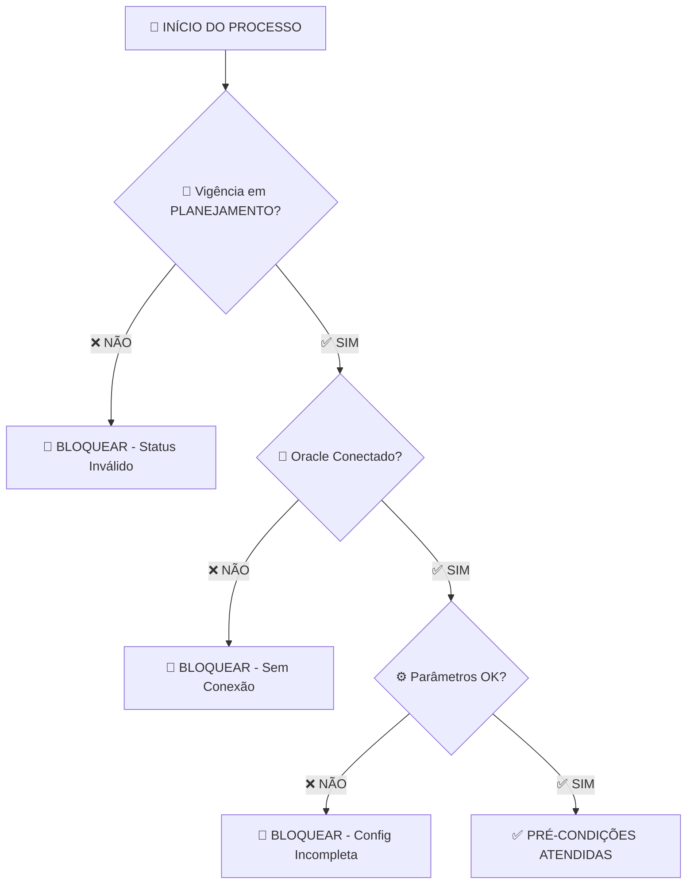
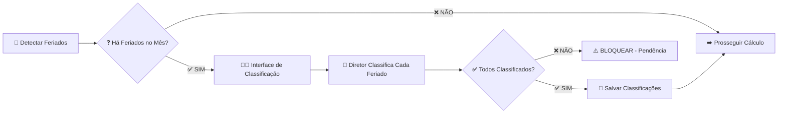
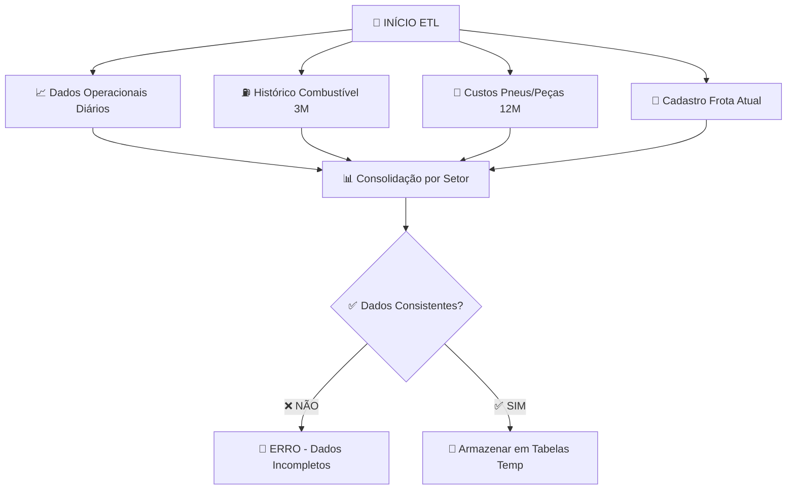
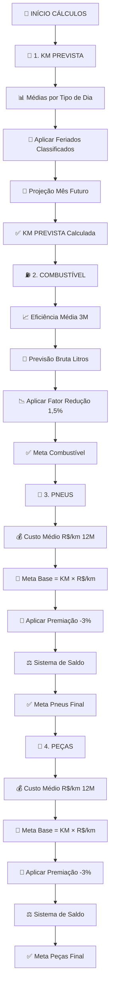
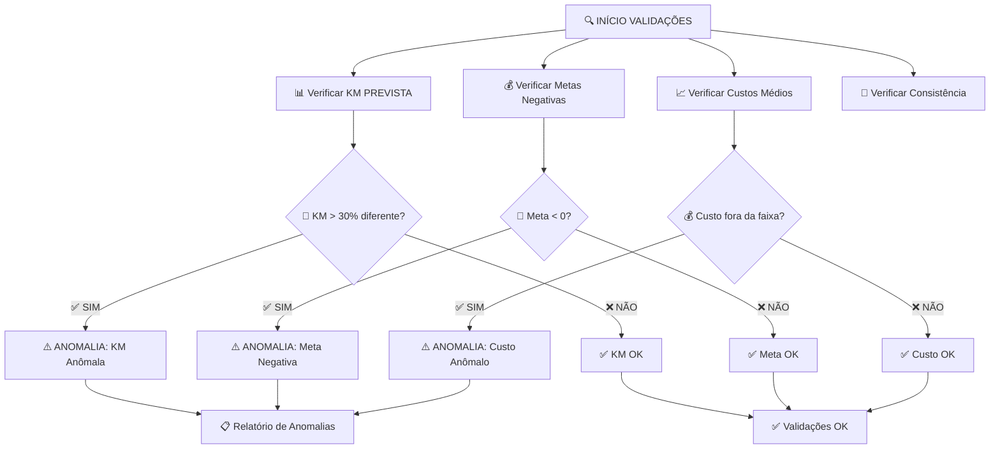
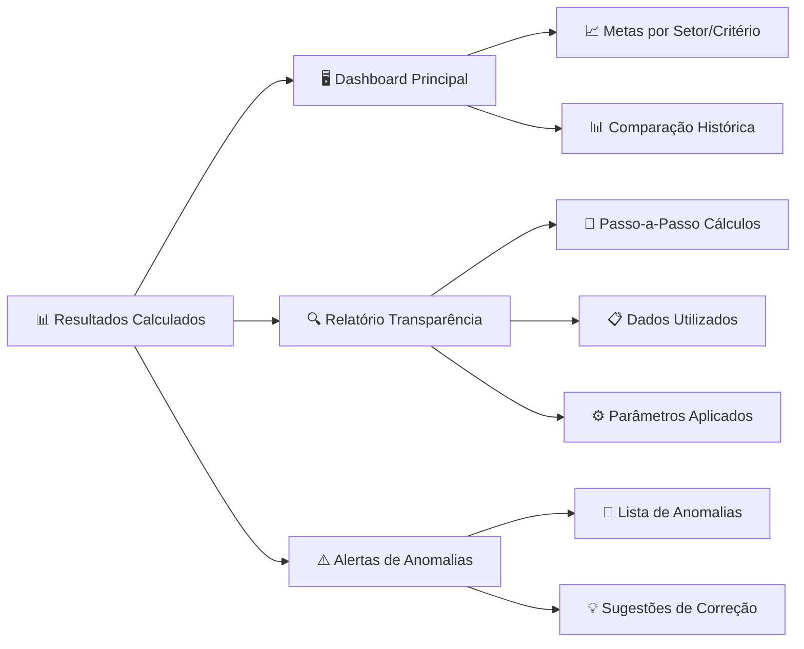
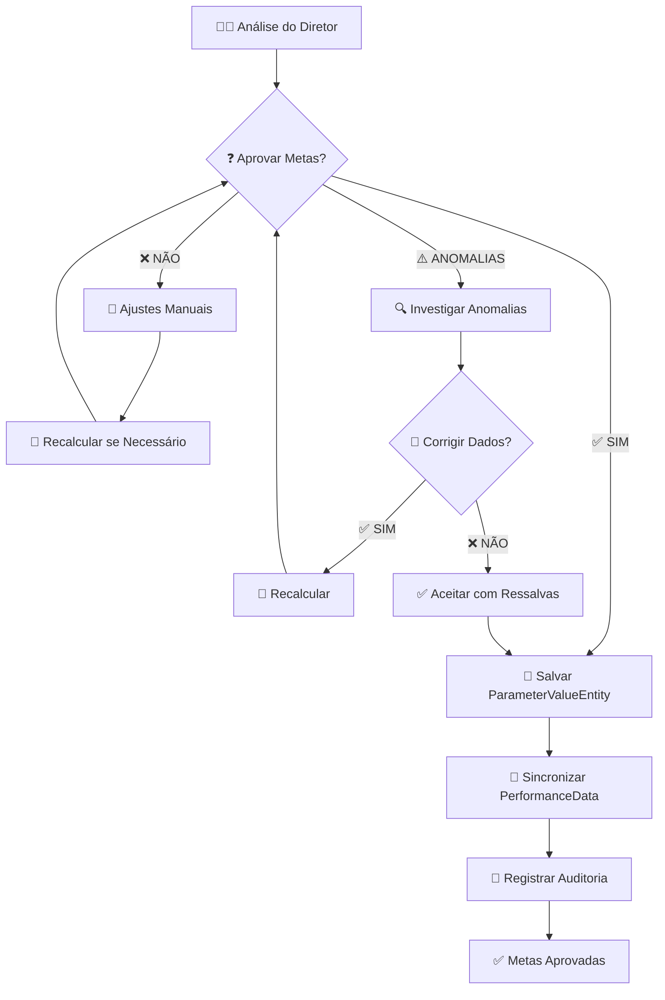
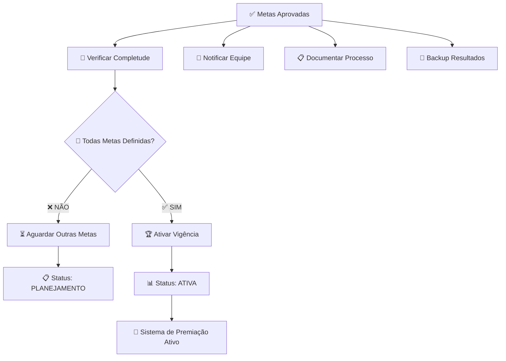

# 🎯 Fluxograma - Automação de Cálculo de Metas Operacionais

**Sistema de Premiação v3.0 | COMBUSTÍVEL • PNEUS • PEÇAS**

---

## 📋 FASE 1: PRÉ-CONDIÇÕES

_Verificações necessárias antes do cálculo_



### ✅ Validações Críticas:

- **Status da Vigência:** Deve estar em `PLANEJAMENTO`
- **Conexão Oracle:** ERP acessível com dados históricos
- **Parâmetros:** Tolerância, fatores, percentuais configurados

---

## 🎉 FASE 2: GESTÃO DE FERIADOS

_Classificação manual necessária para KM PREVISTA_



### 📝 Tipos de Classificação:

- **🏢 Útil:** Feriado trabalhado normalmente
- **🏖️ Sábado:** Operação reduzida como sábado
- **🏠 Domingo:** Sem operação como domingo

---

## 📊 FASE 3: CARREGAMENTO DE DADOS (ETL)

_Extração de dados do Oracle ERP_



### 📋 Dados Necessários:

| Fonte                   | Período  | Uso              |
| ----------------------- | -------- | ---------------- |
| **Operação Diária**     | 3 meses  | KM PREVISTA      |
| **Consumo Combustível** | 3 meses  | Eficiência média |
| **Custos Pneus/Peças**  | 12 meses | R$/km médio      |
| **Frota Ativa**         | Atual    | Qtd veículos     |

---

## 🧮 FASE 4: CÁLCULOS SEQUENCIAIS

_Ordem obrigatória - cada cálculo depende do anterior_



### ⚡ Sequência Crítica:

```
KM PREVISTA → COMBUSTÍVEL → PNEUS → PEÇAS
     ↓             ↓          ↓       ↓
   BASE         DEPENDE    DEPENDE  DEPENDE
```

### 🔢 Fórmulas Principais:

#### 1️⃣ **KM PREVISTA**

```
MediaKmUtil = Σ(KM dias úteis) / Qtd dias úteis
KM_PREVISTA = (MediaKmUtil × DiasUteis) +
              (MediaKmSab × Sabados) +
              (MediaKmDom × DomingosFeriados)
```

#### 2️⃣ **COMBUSTÍVEL**

```
Eficiencia = TotalKM_3M / TotalLitros_3M
LitrosBruto = KM_PREVISTA / Eficiencia
MetaLitros = LitrosBruto × (1 - FatorReducao)
```

#### 3️⃣ **PNEUS**

```
MetaBase = KM_PREVISTA × CustoKmPneu × (1 - %Premiacao)
SaldoDevedor = MAX(0, GastoAnterior - (MetaAnterior × (1 + Tolerancia)))
MetaFinal = MetaBase - SaldoDevedor
```

#### 4️⃣ **PEÇAS**

```
MetaBase = KM_PREVISTA × CustoKmPecas × (1 - %Premiacao)
SaldoDevedor = MAX(0, GastoAnterior - (MetaAnterior × (1 + Tolerancia)))
MetaFinal = MetaBase - SaldoDevedor
```

---

## ✅ FASE 5: VALIDAÇÕES E ANOMALIAS

_Verificações automáticas dos resultados_



### 🚨 Tipos de Anomalias:

| Tipo              | Limite               | Ação                        |
| ----------------- | -------------------- | --------------------------- |
| **KM Anômala**    | >30% variação        | Revisar feriados/dados      |
| **Meta Negativa** | Meta < 0             | Usar meta mínima (10% base) |
| **Custo Anômalo** | Fora faixa histórica | Verificar dados Oracle      |

---

## 📋 FASE 6: APRESENTAÇÃO DOS RESULTADOS

_Interface para análise e aprovação_



### 📊 Interface Inclui:

- ✅ **Dashboard:** Metas calculadas com comparação histórica
- ✅ **Transparência:** "Como chegamos aqui?" completo
- ✅ **Anomalias:** Alertas e sugestões automáticas
- ✅ **Drill-down:** Detalhes por setor/critério

---

## ✅ FASE 7: APROVAÇÃO E INTEGRAÇÃO

_Decisão final e salvamento no sistema_



### 💾 Salvamento Duplo:

1. **ParameterValueEntity** ← Fonte oficial com auditoria
2. **PerformanceDataEntity** ← Cache para sistema de ranking

---

## 🎯 FASE 8: FINALIZAÇÃO

_Ativação do sistema de premiação_



### 🎉 Finalização:

- ✅ **Metas disponíveis** para sistema de ranking
- ✅ **Auditoria completa** registrada
- ✅ **Vigência ativa** se todas as metas estiverem definidas
- ✅ **Equipe notificada** das novas metas

---

## 📊 DADOS DE ENTRADA E SAÍDA

### 📥 **ENTRADAS**

```
┌─ Oracle ERP ─────────────────────────┐
│ • Operação diária (3 meses)         │
│ • Consumo combustível (3 meses)     │
│ • Custos pneus/peças (12 meses)     │
│ • Cadastro da frota (atual)         │
└──────────────────────────────────────┘

┌─ Sistema Atual ──────────────────────┐
│ • Metas anteriores (saldo devedor)  │
│ • Gastos reais anteriores           │
│ • Parâmetros configuráveis          │
└──────────────────────────────────────┘

┌─ Entrada Manual ─────────────────────┐
│ • Classificação de feriados         │
│ • Preço combustível (informativo)   │
│ • Aprovação final das metas         │
└──────────────────────────────────────┘
```

### 📤 **SAÍDAS**

```
┌─ Metas Calculadas ───────────────────┐
│ • COMBUSTÍVEL: Meta em Litros       │
│ • PNEUS: Meta em R$ (com saldo)     │
│ • PEÇAS: Meta em R$ (com saldo)     │
│ • Por setor: 4 setores × 3 = 12     │
└──────────────────────────────────────┘

┌─ Dados de Apoio ─────────────────────┐
│ • KM PREVISTA por setor             │
│ • Relatórios de transparência       │
│ • Metadados dos cálculos            │
│ • Logs de auditoria completos       │
└──────────────────────────────────────┘

┌─ Integração Sistema ─────────────────┐
│ • ParameterValueEntity (oficial)    │
│ • PerformanceDataEntity (cache)     │
│ • Sistema de ranking atualizado     │
└──────────────────────────────────────┘
```

---

## 🚨 PONTOS CRÍTICOS DE ATENÇÃO

### ⚠️ **Bloqueantes Absolutos:**

- 🔴 **Vigência não PLANEJAMENTO** → Para tudo
- 🔴 **Feriados não classificados** → Bloqueia KM PREVISTA
- 🔴 **Dados Oracle incompletos** → Bloqueia cálculos
- 🔴 **Parâmetros não configurados** → Resultados incorretos

### ⚡ **Dependências Sequenciais:**

- 🔗 **COMBUSTÍVEL depende** de KM PREVISTA
- 🔗 **PNEUS depende** de KM PREVISTA + Saldo anterior
- 🔗 **PEÇAS depende** de KM PREVISTA + Saldo anterior
- 🔗 **Ordem obrigatória** - não pode ser paralelo

### 🔄 **Cenários de Recálculo:**

- 📝 **Feriado reclassificado** → Recalcular tudo
- ⚙️ **Parâmetro alterado** → Recalcular afetados
- 📊 **Dados Oracle corrigidos** → Recalcular tudo
- ❌ **Anomalia detectada** → Investigar e recalcular

---

## 💡 BENEFÍCIOS ESPERADOS

### ⚡ **Operacionais:**

- 🚀 **95% redução** no tempo de cálculo (2h → 5min)
- ✅ **Zero erros** de planilha manual
- 🔍 **100% transparência** dos cálculos
- 📊 **Auditoria completa** automática

### 🎯 **Estratégicos:**

- 🏆 **Maior confiabilidade** no sistema de premiação
- 📈 **Decisões baseadas** em dados padronizados
- ⚙️ **Flexibilidade** para ajustar parâmetros
- 🚀 **Base sólida** para futuras expansões

---

**🎉 Fluxograma completo da automação de cálculo de metas operacionais!**

_Sistema de Premiação v3.0 | Documentação Técnica | Julho 2025_
